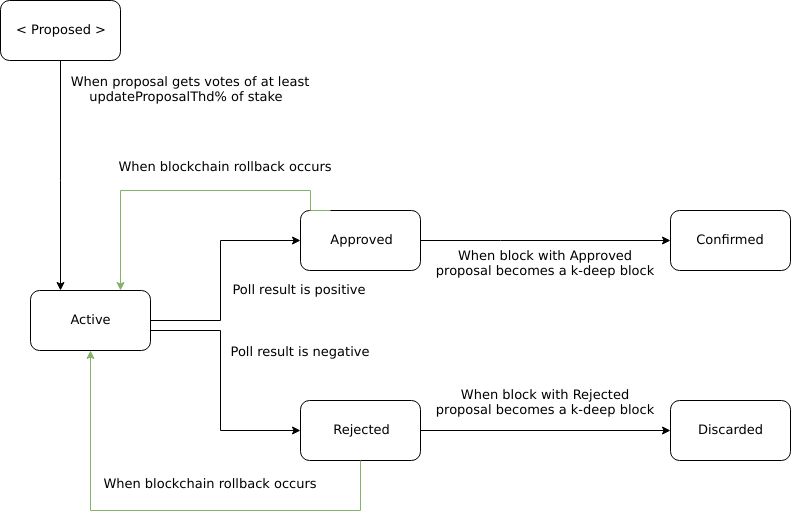

# Update system consensus rules
## Table of contents

  * [Prerequisites](#prerequisites)
  * [Overview](#overview)
  * [Problem definition](#problem-definition)
  * [Update system model](#update-system-model)
    + [Update payload](#update-payload)
    + [Poll and decision agreement rules](#poll-and-decision-agreement-rules)
    + [Update proposal states](#update-proposal-states)
    + [Software and block versions](#software-and-block-versions)
    + [Adoption of block version](#adoption-of-block-version)
      - [Competing block version](#competing-block-version)
      - [Block validation according to adopted version](#block-validation-according-to-adopted-version)
      - [Example](#example)
 * [Verification](#verification)
    + [Block header verification](#block-header-verification)
    + [Update proposal verification](#update-proposal-verification)
      - [General checks](#general-checks)
      - [Protocol version checks](#protocol-version-checks)
    + [Votes verification](#votes-verification)
 * [Confirmation and adoption algorithms](#confirmation-and-adoption-algorithms)
    + [Update proposal confirmation algorithm](#update-proposal-confirmation-algorithm)
    + [Block version adoption algorithm](#block-version-adoption-adoption-algorithm)
 
## Prerequisites

* [Update Mechanism](https://cardanodocs.com/cardano/update-mechanism/).
* [Bootstrap era](https://cardanodocs.com/timeline/bootstrap/).
* [Block structure](https://cardanodocs.com/technical/blocks/#design).
  Specifically, you need to know about how update payload is stored in blocks.
* Please read about
  [balances and stakes](https://cardanodocs.com/cardano/balance-and-stake/) and
  don't confuse them.
* [Block processing](block-processing.md).

## Overview

Update system gives ability to developers to propose updates of software applications and
ability to users to vote for updates to decide which one will be accepted.

This document describes update system model and consensus rules including update payload verification, 
which is part of block payload verification. It's described formally [here](overall.md#task-definition).

Note, this document describes only global part of update system.
Global consensus rules is a part of block processing, 
which checks validity of update payload of block, verify main block header and 
update corresponding state when blocks are applied/rolled back.

Local processing part of update system is to be described in separate document (TODO replace with link to that document as soon it's ready).

## Software update

Update system deals with software updates. Up to date (Dec 2017) all updates are implemented as software updates (there are plans to introduce protocol-only updates, see _[CS-116](https://iohk.myjetbrains.com/youtrack/issue/CS-116) Protocol-constants-only proposal_).

A software update's general purpose is to deliver new code to user. This is reflected in update proposal's structure (in a way it contains references to new installers).

Some software updates may also bring changes to protocol, see more information in [later section](#protocol-update).

### Update payload

Update payload is part of block body, containing some data related to update system.
For more information on block's internals, please visit [page on Cardano Docs](https://cardanodocs.com/technical/blocks/#main-block).

Update payload consists of at most one `UpdateProposal` and list of votes, it's reflected by the datatype:
```
data UpdatePayload = UpdatePayload
    { upProposal :: !(Maybe UpdateProposal)
    , upVotes    :: ![UpdateVote]
    }
```

TODO: add details on UpdateProposal.
TODO: add details on UpdateVote.

#### Software version

Each software update contains `SoftwareVersion` field.

```
data SoftwareVersion = SoftwareVersion
    { svAppName :: !ApplicationName
    , svNumber  :: !NumSoftwareVersion
    }
```

`SoftwareVersion` contains application name and numeric representation of application version.

Software versions from different proposals with same `svAppName` should be in increasing order (see [verification section](#general-checks)).


### Poll and decision agreement rules

Each stakeholder can send update proposal in the blockchain,
and others stakeholders can send their votes "for" or "against" it.
Making decision whether approve or reject an update proposal depends on sum of stake "for" and "against" it.

There are two rules to make decision about update proposal:
* **Explicit agreement**: if an update proposal has greater than 50% stake "for" or "against" 
then the proposal becomes approved or rejected respectively.
* **Implicit agreement**: if an update proposal has been proposed in the blockchain `U` slots ago,
and it has more stakes "for" than "against", then the proposal becomes approved or rejected otherwise.

### Update proposal states



There are five possible states for Update proposal:

* **Active**  
When an update proposal gets into the blockchain within some block, it becomes _active_.
Though the proposal is committed to the blockchain, 
stakeholders are still to be decide whether to approve or to reject this proposal.
So, a poll is active and stakeholders' votes which get into the blockchain affect the decision.

* **Approved**  
If a decision about proposal has been made positively following one of two rules [mentioned above](#poll-and-decision-agreement-rules),
the proposal becomes **approved**.
_Approved_ proposal may become _active_ or even _rejected_ if rollback occurs.

* **Rejected**  
If a decision about proposal has been made negatively, the proposal becomes **rejected**.
_Rejected_ proposal may become _active_ or even _approved_ if block rollback occurs
and poll ended with positive decision on alternative branch.

* **Confirmed**  
If a proposal has been _approved_ in some block and there are at least `k` blocks after this one, the
update proposal becomes **confirmed**.
_Confirmed_ state reflects the fact that _approved_ state cannot be changed anymore 
because we have guarantee that at most `k` blocks may be rolled back.

* **Discarded**  
If a proposal has been _rejected_ in some block and there are at least `k` blocks after this one, the
update proposal becomes **discarded**.
_Discarded_ state reflects the fact that _rejected_ state cannot be changed anymore.
If a proposal is discarded then it doesn't affect consensus rules anymore and it's safe to evict it out of consideration/storages.

## Protocol update

Each block in CSL contains a field, _block version_ which identifies current version of protocol network is supporting (_adopted_ block version).

An update proposal also contains _block version_ field and we consider software update to introduce a protocol update if and only if this version is different from _adopted_ block version.

### Softfork and hardfork

There are two options to update protocol version: via softfork or via hardfork.

A soft fork proposes modifying blockchain consensus rules so that the new version blocks are still compatible with old version clients. A hard fork is one that doesn’t maintain backward compatibility with the previous version.

[BIP-99](https://github.com/bitcoin/bips/blob/ed283b05b332b85b6fd683be3a5d73fab6c15554/bip-0099.mediawiki) provides excellent criteria to distinguish between these two fork types:

* A **soft fork** introduces new rules, or restrictions, on blocks. That way, everything that was previously invalid remains invalid, while some blocks that would have been previously considered valid become invalid.
* A **hard fork** is a fork that makes previously invalid blocks valid.
Soft forks have some deployment advantages like backward compatibility, and they don’t require everyone’s consensus, as the stake majority of users can impose the new rules. By contrast, hard forks require all users to upgrade.

In theory, a hard fork may lead to a situation when a network splits into two parts, each maintaining a separate chain: 

 * one from the nodes that adopted the latest system update
 * another from the nodes that rejected to adopt the latest system update

This means some blocks from the first part are considered invalid by the other part, and vice versa.

### Block version

Block version is represented by following data structure:

```
data BlockVersion = BlockVersion
    { bvMajor :: !Word16
    , bvMinor :: !Word16
    , bvAlt   :: !Word8
    }
```

As you see, block version essentially is a tuple `(Maj, Min, Alt)`. It has following sematics:

* Major version (2 bytes): change of the `Maj` version identifies a protocol is being updated via hardfork
* Minor version (2 bytes): change of the `Min` version identifies a protocol is being updated via softfork
   * Changes should be backward-compatible in a sense that a block generated by the new client should be accepted by old client.
* Alt version (1 byte): integer to manage several simultaneous protocol update proposals.
   * It allows independent developers to introduce multiple changes to the protocol simultaneously. For example, if one vendor decides to introduce feature X via a soft fork, and another proposes feature Y (also via a soft fork), their software will be issuing blocks with versions a.b.X and a.b.Y, which can coexist in the blockchain (see [section](#competing-block-version)). However, only one will eventually be adopted.

Block version is also often referred to as **protocol version**.

### Protocol constants

Cardano SL supports number of constants associated with block version.

Protocol constants provide us more freedom to express protocol updates via softforks (i.e. without need for hardforks).

Clients which run old version of protocol will be able to follow the blockchain (i.e. validate new blocks) without being updated even if protocol changed in following ways:
 
 * Block size limit changed
 * Slot duration changed
 * Transaction fee policy changed

Without protocol constants mechanism all these changes would definetely require a hard fork.

If some update proposal introduces a protocol update, it may also change some of protocol constants, providing new values via `BlockVersionModifier` field of the update proposal:

```
data BlockVersionModifier = BlockVersionModifier
    { bvmScriptVersion     :: !(Maybe ScriptVersion)
    , bvmSlotDuration      :: !(Maybe Millisecond)
    , bvmMaxBlockSize      :: !(Maybe Byte)
    , bvmMaxHeaderSize     :: !(Maybe Byte)
    , bvmMaxTxSize         :: !(Maybe Byte)
    , bvmMaxProposalSize   :: !(Maybe Byte)
    , bvmMpcThd            :: !(Maybe CoinPortion)
    , bvmHeavyDelThd       :: !(Maybe CoinPortion)
    , bvmUpdateVoteThd     :: !(Maybe CoinPortion)
    , bvmUpdateProposalThd :: !(Maybe CoinPortion)
    , bvmUpdateImplicit    :: !(Maybe FlatSlotId)
    , bvmSoftforkRule      :: !(Maybe SoftforkRule)
    , bvmTxFeePolicy       :: !(Maybe TxFeePolicy)
    , bvmUnlockStakeEpoch  :: !(Maybe EpochIndex)
    }
```

If constant value is going to be updated to `newValue` then a field is `Just newValue` and `Nothing` otherwise.

### Block version life cycle


Once an update proposal which introduces a protocol update becomes _confirmed_, corresponding block version may have one of following states:

* Competing
  * Block version which is candidate to be *adopted*
* Adopted
  * Current version of protocol
* Never to become Adopted

At any point in time, only one version is considered *adopted* by blockchain. This version is used to validate all blocks coming to blockchain. List of block versions which were at some point considered *adopted* form a linear order on `(Maj, Min)` pairs.

#### Competing block version

Block version is called **competing** if it may become adopted and 
there is a confirmed proposal with this block version.

NB: when some block version `(Maj, Min, Alt)` is adopted, only following versions may be competing:
* `(Maj, Min+1, Alt')`
* `(Maj+1, 0, Alt')`

#### Adoption of block version

Informally, `bv = (Maj, Min, Alt)` becomes **adopted** iff:
 * `bv` is *competing*
 * sum of block issuers' stakes, which issued a block with this `BlockVersion`, takes a significant part of the stake

Formally, a proposal becomes **adopted** iff:
* the proposal became _confirmed_ in epoch `s`
* current epoch is `t`
* portion of block issuers' stakes, which issued blocks with this `BlockVersion` at least once, is greater than:
  `max spMinThd (spInitThd - (t - s) * spThdDecrement)`

Intuitively, the threshold which needed to adopt `BlockVersion` is decreasing in each epoch but cannot become
less than some reasonable minimal value (`spMinThd`).

Competing versions are checked at the beginning of each epoch (whether one of them became *adopted*).

### Example

Assume there are four stakeholders with stakes `[0.25, 0.26, 0.39, 0.1]`,
`lastKnownBlockVersion` is `0.1.0` for all stakeholders' softwares and 
last adopted block version is also `0.1.0`.

Then update proposal which bumps block version to `0.2.0` is confirmed in 2nd epoch.
Suppose this proposal adds consensus rule, 
that block header's attributes should contain by key `228` string `"pva"`.

Then the first stakeholder downloads this update and updates own software. 
`lastKnownBlockVersion` is `0.2.0` for this software but last adopted block version is still `0.1.0`.

Then it's turn to issue a block of the first stakeholder as leader of some slot.  
To be valid for others stakeholders, issued block should be created by rules for last adopted version, so
updated software of the first stakeholder considers last adopted block version.  
If last adopted is `0.1.0` then the software creates block using old logic (logic for `0.1.0`)
otherwise using new logic (logic for `0.2.0`).  
The last adopted version is `0.1.0`, hence, the first stakeholder issues a block:
* `BlockVersion` of this block is set to `0.2.0`
* block created by rules for last adopted block version, i.e. `0.1.0`. 

So the block is issued without new attribute but tagged by the new version.
Stakeholders with old software expects that all attributes are known because
last adopted block version equals `lastKnownBlockVersion` for its softwares.

Then the 3rd epoch starts and the threshold (which is regulated by genesis `SoftforkRule`) 
for adopting new block version is `0.85`.

Then the second stakeholder downloads this update and when it's turn to issue block, 
the stakeholder issues block like it has been done by the first stakeholder.
Also the second one issues one more block as leader, so it produced 2 blocks.

Then 4th epoch starts, adopting threshold is `0.80` and sum of issuers stakes is `0.25 + 0.26 = 0.51 < 0.80` 
(we take into account the second stakeholder only once). 
So last adopted block version is still `0.1.0`, `lastKnownBlockVersion` is `0.2.0` for 
the first and the second stakeholders and `0.1.0` for the third and the fourth.

Then the third stakeholder downloads this update and issues block in the same manner like previous ones.

When 5th epoch starts, adopting threshold is `0.75` and
sum of issuers stakes is `0.25 + 0.26 + 0.39 = 0.9 > 0.75` and it's time to bump last adopted block version.
So last adoped version is `0.2.0` now and `lastKnownBlockVersion` is `0.1.0` 
for the latter stakeholder and `0.2.0` for others.

When it's turn to issue block of the fourth stakeholder, 
his software checks that his `lastKnownBlockVersion` mismatchs the last adopted block version
and the software gives up issuing a block. So this slot left without a block.

You can see despite the provided update system is powerful, it's also very complicated 
and updates should be handled carefully.

## Verification

### Block header verification

First of all, we check that block version of a verifiable block is _adopted_ or [competing](#competing-block-version).

### Update proposal verification

#### General checks

* _No duplicated proposer check_: that no stakeholder sent two update proposals within current epoch. 
We prohibit it because of opportunity to spam update proposals from one stakeholder.

* _Update proposal size check_: proposal doesn't exceed maximal proposal size.
  * Update proposal size is computed as number of bytes in serialized `UpdateProposal`.
  * Update proposal size limit is part of `BlockVersionData`.
  * If the size of a proposal is greater than the limit from the adopted `BlockVersionData`, the proposal is invalid.

* _Attributes known check_: if `verifyAllIsKnown` (defined [here](overall.md#verifyallisknown-flag))
is `True`, all update proposal attributes must be known.
 
* _Uniqueness of proposal check_: that there is no active proposal with the same id.

* _Software version check_: numeric software version of application is 1 more 
than of last confirmed proposal for this application. 
Numeric software version should be zero for a new application name.

* _Stake to include into block check_: sum of positive votes for this proposal is enough 
to be included into block (at least `updateProposalThd`).
We wouldn't like adversary stakeholders to have opportunity to spam blockchain by `UpdateProposal`.
So everyone can send update proposal to network, but it can get into block only along with enough votes.

#### Protocol version checks

* _Protocol version following check_: 
  * The proposed major version must be equal to or greater by `1` last adopted one.
  * If the proposed major version is greater than last adopted one by `1`, then minor version must be `0`.
  * If the proposed major version is equal to the last adopted one, then minor version 
    can be either same as the last adopted one or greater by `1`.
  * If `(Major, Minor)` of proposed version is equal to `(Major, Minor)` of
    last adopted version, then alternative version must be equal to alternative version of last adopted version.
    * Otherwise `(Major, Minor)` of proposed version is lexicographically greater 
      than `(Major, Minor)` of last adopted version. In this case
      other proposed block versions with same `(Major, Minor)` are considered. 
      Let's call set of these block version `X`:
      * If `X` is empty, given alternative version must be `0`.
      * Otherwise it must be in `X` or greater than maximum from `X` by `1`.

* _BlockVersionModifier consistenty check_: `BlockVersionModifier` from proposal is consistent 
with `BlockVersionData` for adopted protocol version or 
with `BlockVersionModifier` from _competing_ proposals with the same protocol version.  
There are three cases to check:
  * Block version from proposal is equal to adopted version. 
    In this case each field of `BlockVersionModifier` from proposal must be either `Nothing` or 
    `Just` with the same value from `BlockVersionData` of last adopted version, 
    i.e. we forbid changing any protocol constants. 
  * Block version from proposal is equal to one from another proposal. 
    `BlockVersionModifier`s from them must be the same. 
     If several proposals with the same block version exist, then all `BlockVersionModifier` must be equal.
  * Block version from proposal is new one. 
    In this case we must check `BlockVersionModifier` from the proposal is consistent with adopted `BlockVersionData`.  
    The following checks take place:
    * Script version from proposal must be equal to or greater by `1` than adopted one.
    * Max block size from proposal is at most two times greater than adopted one.
    * Unlock stake epoch must not be changed if boostrap era is over.

### Votes verification

For each vote the following checks must be performed:

* _Voter stake check_: stakeholder who issued given vote has enough stake (at least `bvdUpdateProposalThd`).
  Note: `bvdUpdateProposalThd` is used by mistake, `bvdUpdateVoteThd` must be used. It will be resolved in the future.

* _Existence proposal check_: proposal with such proposal id exists.

* _Active proposal check_: proposal is still active.

* _Revote check_: a stakeholder who issued the vote doesn't revote twice or send the same decision twice.  
  It's allowed for any stakeholder to vote no more than one time and 
  also change his decision to opposite no more than one time.

## Confirmation and adoption algorithms

In the previous sections we touched _explicit agreement rule_ and _adoption of block version_,
we will describe them in details in this section.

### Update proposal confirmation algorithm
In this section we describe update proposal confirmation algorithm more carefully, 
in particular, the rules for cases when there are several concurrent update proposals.

On each main block the following algorithm is performed
1. Take all proposals which were decided at least `k` block ago.  
   It may be determined by chain difficulty.
2. Group proposals by application name.
3. Sort each group using the following rule:
  * Construct tuple  
    (decision, whether decision is implicit, positive stake, slot when it has been proposed)  
    by each proposal. So a tuple has type `(Bool, Bool, Coin, SlotId)`
  * Compare in decreasing order.  
    So at the beginning of sorted list,  _approved_ proposals will follow, if there is more than one,
    approved explicitly and so on.
4. All proposals in each group except a head become _discarded_.
5. Head proposal of each group become _confirmed_ if it's _approved_ and _discarded_ if it's _rejected_.

### Block version adoption algorithm

In this section we describe block version adoption algorithm more precisely.

On each genesis block the following algorithm is performed:
1. Compute threshold for current epoch for adoption of block version, let's call it `T`.
2. For each competing block version do the following steps:
    1. Compute summary stake of stakeholder which issued a block of this block version and 
       corresponding to slots no greater than `8k` of the previous epoch. 
       Such blocks can't be rolled back, hence, summary stake can't be changed.  
       Notice, if a stakeholder issued two or more blocks with this block version, it's counted only once.
    2. If summary stake is greater than total stake multiple by `T` then this block version can be adopted.
3. Take all block versions from the previous step which can be adopted, let's call them `S`.  
   If `S` is empty then there is nothing to adopt, otherwise take maximal block version from `S`, let's call it `V`.
4. `V` becomes new adopted version. Other competing versions
   that can't become adopted because they are less than `V`
   aren't competing anymore and thrown away from the consideration.
   
