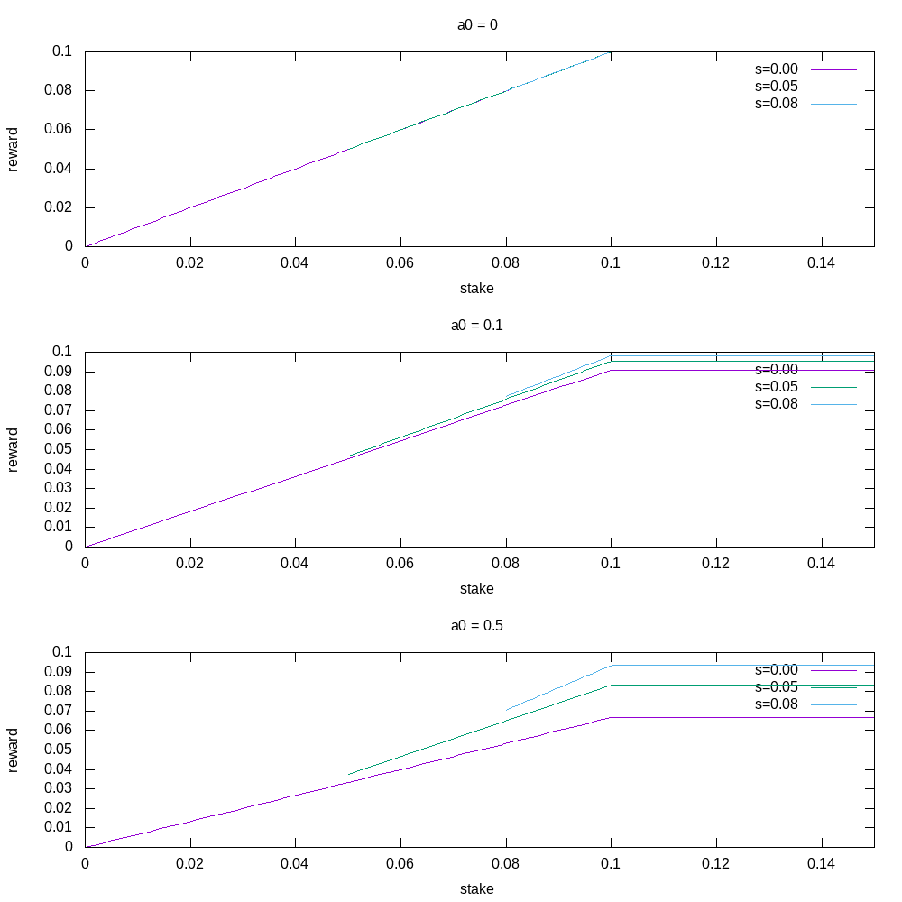

---
title: Design Specification for Delegation and Incentives in Shelley
subtitle: 'Status: DRAFT'
author: Lars Brünjes, Philipp Kant
documentclass: scrartcl
toc: t
numbersections: true
# This document uses pandoc extensions to markdown. To compile, use
#   gnuplot rewards.gnuplot
#   pandoc -o delegation_design_spec.pdf delegation_design_spec.md
...

# Acknowledgements

_List of Contributors:_
Lars Brünjes,
Duncan Coutts,
Philipp Kant,
Dimitris Karakostas,
Aggelos Kiayias,
Elias Koutsoupias,
Mario Larangeira,
Aikaterini-Panagiota Stouka.

# Purpose
This document describes the requirements and design for a
delegation- and incentives-mechanism to be used in the Shelley release of Cardano.

Delegation will allow holders of Ada to transfer their rights to
participate in the proof of stake (_PoS_) protocol to _stake
pools_. Stake pools are run by _stake pool operators_
(also called _pool leaders_),
and a person delegating to a stake pool is called _delegator_, _member_, or
_participant_ of a stake pool.

Introducing delegation is important to increase the stability and
performance of the system:

- We cannot expect every holder of Ada to continuously run a node that
  is well-connected to the rest of the network, in order to write a
  block on rare occasions. Some users might lack the expertise to do
  so. Most users will not have enough stake to warrant running their
  own node. Delegation allows all holders of Ada to participate in the
  protocol, regardless of their technical abilities and the amount of
  stake that they hold. Thus we expect less stake to be offline,
  making the system faster and more resilient against an adversary.
- Even if every user were to run a node that was online all the time,
  it would be hard to keep all those nodes well enough in sync to
  avoid forks and still keep a short slot length. Our delegation
  design is aimed at keeping the number of nodes that produce a
  significant amount of blocks reasonably small (about 100 nodes), so
  that effective communication between them is feasible.

This document covers the design of necessary additions to Cardano in
order to support and incentivise delegation.

# Prerequisites

## HD Wallets

We will use a Hierarchical Deterministic wallet (HD wallet) structure,
as described
in
[BIP-32](https://github.com/bitcoin/bips/blob/master/bip-0032.mediawiki).

# Assumptions

# Requirements
The delegation mechanism should meet a number of requirements.  They
can be grouped into functional requirements that the delegation system
should provide, requirements to the security (both of the overall
system and the funds of individual users), and existing features that
should not be impeded when we add delegation to the system.

## Functional Requirements

### Proof of Eligibility

Any slot leader -- and in particular stake pool operators, who are
elected through stake that is delegated to them -- should be able to
prove when they are eligible to produce a block in a given slot.

### Visibility of Delegation on the Blockchain

We expect stake pools to share their rewards with the delegators.  In
order to do this, there must be evidence for the delegation
happening.  Furthermore, we want the sharing of rewards to be
enforced by the protocol, so the evidence must be recorded on the
blockchain.

### Restricting Chain Delegation

We do not want to allow stake to be re-delegated along a chain
arbitrarily.  We will admit some level of indirection, but not more
than necessary to meet the rest of the requirements.

One reason that we do not want arbitrary chain delegation is that it
makes it harder for delegators to figure out who is ultimately
controlling their stake. Another is that unlimited chain delegation
could open up a Denial-of-Service (DoS) attack vector on the system,
where the attacker posts long delegation chains in order to slow down
processes that depend on delegation, such as leader election or
rewards sharing.

We must also have a mechanism to prevent cycles (such as A delegates
to B, and B delegates to A) which would introduce ambiguity to the
question of who manages stake in the end.

### Cheap Re-Delegation

Changing delegation preferences should be as cheap as possible
(while still using appropriate fees to prevent a denial of service
attack on the blockchain).

### Neutral Addresses

We should provide addresses that can hold value, but do not contribute
to the PoS protocol.  Those might be appropriate for use by exchanges,
which will hold large amounts of value, without legally owning it.

## Security Requirements

### Sybil Attack Protection at Stake Pool Level

It is conceivable that an an adversary might try to take over the
network by registering a large number of stake pools, hoping they
accumulate enough stake to mount an attack just by people randomly
delegating to them.

This Sybil attack on the level of stake pools should be made
infeasible, by requiring stake pool operators to allocate a finite
resource to each individual pool they register. In particular, this
resource cannot be the cost of operating a node, since it is possible
to run multiple pools with one node, so that cost would be constant in
the number of pools an adversary is registering.

### Address Nonmalleability

The system should provide protection against the following attack:

Changing Delegation through Address Malleability

:   Suppose that Alice makes a payment to Bob. In preparation, Bob
    transmits an address belonging to his wallet to Alice, and expects
    Alice to pay to that address. If his wallets later on shows that
    his balance is increased by the expected amount, he considers that
    transaction to be successful. An attacker that wants to increase
    their influence on the PoS protocol changes the address that Bob
    sends in such a way that funds in that address are delegated to
    the attacker, but the funds still show up in Bob's wallet.

    The attack is considered successful if the staking rights for the
    transferred money belong to the attacker after the transaction,
    without Alice and Bob noticing the attack.

### Public Spending Keys Should not be Disclosed Prematurely

Delegation of stake should not involve revealing the public spending
key.  The public spending key should only be revealed once the funds
that are controlled by the corresponding private key are actually
transferred to another address.

### Mitigate Key Exposure

A node run by a stake pool will need to have some key that controls
all the delegated stake, in order to sign blocks.  In case of an
incident where the node is compromised, it should be possible for the
stake pool operator to revoke the key, and replace it with a new one.
This should not require any action by the delegators.

### Handle Inactive Stake Pools

We anticipate that a stake pool operator can cease to operate --
whether they lost their keys, lost interest, died, etc.  We want to
minimise the effect of this to the security and liveness of the
system.

### Avoid Hard Transition

When we make the switch from Byron (where all stake is delegated to
the nodes controlled by the Cardano Foundation, Emurgo, and IOHK) to
Shelley (where Ada holders have the freedom to control their stake),
we should avoid a scenario where a significant amount of stake is
suddenly offline.

This could happen if we automatically revoked the automatic delegation
to the core nodes of the Byron network.

### Change Delegation Without Spending Key

Users of a cold wallet, such as a paper wallet or a hardware wallet,
should be able to delegate the stake corresponding to the funds in the
cold wallet without using its spending key.

## Requirements to Preserve Existing Features

### Master Recovery Key

The whole wallet should be recoverable from one single key (without
any additional information, such as the delegation preferences of the
wallet).

The computational complexity of the recovery process should not be
worse than logarithmic in the number of addresses appearing on the
blockchain, and linear in the number of addresses in the wallet.

### Address Recognition

An HD wallet should be able to recognise its addresses in the UTxO, so
that it can report balances and transaction histories to the user.

### Wallet should be Runnable on Independent Devices

Different user interfaces, running on different devices, should be
able to access and control the same wallet, without transferring
state between them.

We will accept some degradation of behaviour when running the wallet
on different devices:

- Both copies might generate the same fresh addresses
- There can be differences in the reported balance while there are
  transactions in flight that only one of the two copies has knowledge
  of.  In particular, when one copy sends a transaction, that
  transaction will only affect the balance reported by the other
  wallet once it is recorded on the blockchain.
- If the wallets use different delegation preferences, funds sent to
  the wallet might end up being delegated to different pools.

### Maintain Privacy

HD Wallets maintain some level of privacy by using multiple
addresses that are not obviously and publicly tied to the same
wallet.  Delegating stake should not necessarily link the addresses
in the wallet of a delegator.

### Short Addresses

Adding delegation to the system should not increase the length of
addresses more than necessary. Ideally, we should use the necessary
changes to the address scheme to come up with an address length that
is even shorter than in Byron.

# User Stories

## Basic Delegation User Stories

TODO: Add User Stories

## User Stories Related to Incentives

### [CDEC-92] Stake Pool Operator Performance Incentives

### [CDEC-91] Optimal stake distribution

TODO: Add User Stories

# Design of Delegation

## Overview of Delegation

Delegation is a separation of the control over the movements of funds
and the rights in the Proof of Stake protocol that are associated with
those funds.  We achieve this separation by introducing another type
of key: while the rights to move funds are tied to a _payment key
pair_ $K^p=(skp, vkp)$, the rights to take part in the PoS are tied to
the _staking key pair_ $K^s=(sks, vks)$.  Here, $skp$ and $sks$ are
the private keys used for signing, and $vkp$ and $vks$ are the public
keys used to verify signatures.

An owner of funds (i.e., the owner of the payment key of those funds)
can _delegate_ their stake to the owner of a particular staking key
$K^s$ by declaring that the stake rights of those funds should be
controlled by $K^s$.  There are different mechanisms for that, aimed
for different use cases.

## Address Structure

Shelley will introduce three different types of addresses: _base
addresses_, _pointer addresses_, and _enterprise addresses_.  Each address
has the form

$$
\mathcal{H}({vkp}) || \beta
$$

where $\mathcal{H}({vkp})$ is a cryptographic hash of the public
spending key, and $||$ denotes string concatenation.  The types of
addresses differ in the _staking object_ $\beta$, which carries the
staking information.

In addition to those new addresses, the system will continue to
support _bootstrap addresses_ and _script addresses_ as introduced in
Byron.

### Base Address

A base address sets the staking rights directly to a staking key
$(sks, vks)$, and sets $\beta = \mathcal{H}(vks)$.  The staking rights
associated with funds held in this address are controlled by the owner
of $sks$.

### Pointer Address

A pointer address indirectly specifies the staking key that should
control the stake of the address.  It does so by referencing a
delegation certificate that has been published to the blockchain.

Concretely, for a pointer address, $\beta$ is a _certificate pointer_,
given by the tuple $(N_\text{block}, N_\text{tx}, N_\text{cert})$,
where $N_\text{block}$ is the number of a block in the chain, and
$N_\text{tx}$ is the number of a transaction within that block. This
transaction should, as its $N_\text{cert}$s metadata, contain a
heavyweight delegation certificate[^pointer-heavyweight] (see
\ref{certificates-on-the-blockchain} below).

### Enterprise Address

Enterprise addresses allow completely opting out of participation in
the proof of stake protocol.  This might be appropriate for exchanges,
which control, but not own, large amounts of Ada.

For enterprise addresses, $\beta$ is set to a fixed constant value,
making them easily distinguishable from other types of addresses.

When determining the stake distribution for the Follow the Satoshi
algorithm, enterprise addresses are completely ignored.  Thus, holding
funds in an enterprise address will not increase the chances for being
elected as a slot leader.  Note however, that this effectively decreases
the total amount of stake, which plays into the hands of the
adversary.

### Bootstrap Address

Bootstrap addresses were introduced in Byron, and they always delegate
their stake to a fixed set of seven staking keys, corresponding to the
seven core nodes operated by Cardano Foundation, Emurgo, and
IOHK[^Bootstrap].

[^Bootstrap]: TODO: insert detailed description of bootstrap addresses.

Bootstrap addresses will continue to exist in Shelley, but their use
will be disincentivised.

### Script Address

Another type of addresses present since Byron are script addresses.
For those, it is hard to determine whom the funds actually belong to.
The stake corresponding to funds in script addresses will be excluded
from participation in the proof of stake protocol, just as is done for
enterprise addresses.

### HD Wallet Structure in Shelley

The wallet will be a hierarchical deterministic wallet, according to
[BIP-32](https://github.com/bitcoin/bips/blob/master/bip-0032.mediawiki).

Furthermore, we will require that the tree of addresses has a fixed
depth, and that the wallet will only generate a certain number of new
addresses before old ones have been used. These requirements allow us
to keep wallet restoration from seed cheaper than linear in the total
number of addresses in the blockchain. For details, see
\ref{wallet-recovery-process}.

## Certificates

Certificates allow transferring stake rights to specific staking keys.
They can either be posted to the blockchain as transaction metadata
(stakepool registration or retirement, as well as heavyweight
delegation certificates), or revealed upon use (lightweight
certificates).

### Certificates on the Blockchain

Certificates can be publicly announced to all participants by posting
them to the blockchain, as transaction metadata. They will remain
valid until explicitly overwritten or revoked, as an automatic expiry
would likely increase the amount of undelegated, offline stake. The
following certificates can be posted to the blockchain:

Stakepool Registration Certificates

:   A person planning to operate a stake pool can anounce this by
    posting a _stakepool registration certificate_ to the blockchain.

    The certificate must contain the following information:

    - the public staking key, $vks_\text{delegate}$
    - the parameters that specify the reward sharing function of the
    stake pool (cost and margin of the pool)[^incentives]
    - the minimal amount of Ada that the stake pool operator promises
    to deposit to the stake pool
    - an address to which the rewards for the stake pool operator will
      be sent[^stakepool-piggyback]
    - optionally, a stake pool can include an address to which the
      rewards of the pool that exceed the costs and margin are sent.
      If they do, the stake pool members will not get rewards for
      delegating, and their share will go to the specified address
      instead. This will allow stakeholders who do not want to get
      rewards (possibly for regulatory or tax reasons) to delegate to a
      stake pool that benefits a charity.

    Additional, personal, information on the stake pool operator will
    be hosted separately from the blockchain, see \ref{stakepool-registration}.

[^incentives]: This will be elaborated once this document is merged
with the incentives design document.

[^stakepool-piggyback]: A priori, the rewards for the stake pool could
also be distributed amongst the addresses that use the stake pool's
staking key. However, this would allow anybody to piggyback on the
stake pool by using addresses that use the stake pool's staking
key.

Stakepool Retirement Certificate

:   If a stakepool can foresee that it will cease operations, it can
    announce this intent by posting a _stakepool retirement
    certificate_. It contains

    - the public staking key $vks_\text{pool}$ of the pool
    - the epoch number, starting from which the stakepool will cease
      to operate

    It must be signed by the staking key $sks_\text{pool}$ of the pool.

    After the retirement epoch, any stake that is delegated to this
    stake pool will be disregarded for the PoS protocol. It will not
    take part in the leader election process (similarly to how stake
    in an enterprise address is not considered during the election
    process).

    Stakeholders who delegated to this pool should be notified and
    asked to redelegate by their wallet the next time they are online.

Heavyweight Delegation Certificates

:   Users can transfer the rights of participation in the PoS protocol
    from one staking key to another, by posting a _heavyweight
    delegation certificate_ to the blockchain.  A heavyweight
    delegation certificate is a tuple containing

    - the public staking key delegating its staking rights,
    $vks_\text{source}$
    - the public staking key to which stake is delegated,
    $vks_\text{delegate}$[^heavyweight-pointer]

    It must be signed by $sks_\text{source}$.

Delegation Revocation Certificate

:   Users might want to take control of stake that they had previously
    delegated.  They can do that by posting a _delegation revocation
    certificate_, containing the key for which they want to invalidate
    previously posted delegation certificates. It must be signed by
    the corresponding secret key. A pointer address which points to a
    revoked certificate will not be included for leader election.

### Lightweight Delegation Certificates

In addition to certificates posted on the blockchain, the system will
also support _lightweight delegation certificates_.  They specify
that the staking rights are transferred from a source key
$vks_\text{source}$ to a delegate key $vks_\text{delegate}$.  In
contrast to heavyweight certificates, they are not posted to the
blockchain, but instead included in the block header when a block is
signed with $sks_\text{delegate}$ (or in a message of the coin-tossing
algorithm when $sks_\text{source}$ is elected as a member of the
committe for randomness generation).

The purpose of lightweight certificates is to enable stake pool
operators to mitigate key exposure, \ref{mitigate-key-exposure}.  The
setup is as follows:

- The stake pool operator registers their stake pool, using a key
  $vks_\text{cold}$.  This _cold key_ is kept securely and off-line.

- The stake pool operator uses $sks_\text{cold}$ to sign a lightweight
  certificate $C$, transferring the staking rights to a _hot key_
  $vks_\text{hot}$.

- The stake pool operator keeps $sks_\text{hot}$, as well as $C$, on a
  node that is on-line, and can sign blocks.  A block signed with
  $sks_\text{hot}$ will be considered valid, provided that $C$ is
  included in its header.

- Should the node get hacked, and the hot key compromised, the stake
  pool operator will create a new lightweight delegation certificate
  $C'$, delegating the staking rights to a new hot key
  $vks_{\text{hot}'}$.

  In order to render $sks_\text{hot}$ useless, it must be established
  that $C'$ takes precedence over $C$.  For this purpose, the
  lightweight delegation certificate will have an additional integer
  field, and certificates with a larger value for this field will take
  precedence.

### Chain Delegation

Chain delegation is the notion of having multiple certificates chained
together, so that the source key of one certificate is the delegate
key of the previous one.

We will only allow a very simple form of chain delegation, where we
have zero or one of each of the following certificates, in that order:

1. heavyweight certificate
2. stake pool registration certificate
3. lightweight certificate

This restricted pattern of chain delegation allows us to satisfy all
requirements, but avoids problematic cycles in the graph of delegation
certificates, and makes it easier for the nodes to track the
delegation patterns.

### Certificate Precedence and Validity

The following rules determine precedence and validity of
certificates.  In particular, they describe what happens when multiple
certificates are issued for a given staking key.

The ordering of blocks and transactions induces a canonical ordering
amongst certificates. Thus, the terms older/newer certificate are well
defined and are used below.

#### Stake Pool Registration and Retirement Certificates

- There can be at most one active stake pool registration certificate
    for any given staking key. A newer certificate will override an
    older one.

    This will allow stake pool operators to update their costs and
    margin if they need to. Stake pool members should be notified of
    such changes by their wallet the next time they are online.

- A revocation certificate is only valid if there is an older
  registration certificate.

#### Heavyweight Delegation and Revocation Certificates

- Newer heavyweight certificates override older heavyweight
  certificates. This allows delegators to move from one stake pool to
  another.

- Revocation certificates revoke the effect of older (but not newer)
  heavyweight certificates. So users with base addresses can join a
  staking pool, leave it and control their stake directly, and still
  have the opportunity to join a staking pool at a later point in time.

#### Lightweight Delegation Certificates

For lightweight certificates, we cannot rely on the ordering induced
by the blockchain. But we do have the counter field, which serves the
purpose of establishing precedence:

- A lightweight certificate with a higher counter overrides one with a
  lower counter.

### Additional Local Node State

It is not sufficient for certificates to be posted to the blockchain:
since nodes will need to validate signatures on new blocks in a timely
manner, they need ready access on all valid certificates without
resorting to the blockchain itself. Distributing rewards
(\ref{sharing-rewards}) requires further additional state.

Nodes will have to maintain the following local databases as they
process blocks:

#### Stake Pools

Pointer addresses (\ref{pointer-address}) need to reference a specific
stake pool registration certificate. Since this is part of the
address, the key should be short. A canonical unique index that is
reasonably short is the certificate pointer described in
\ref{pointer-address}.

Access patterns:

- Lookup by certificate index whenever the staking rights for a
  pointer address have to be resolved
- Lookup by public staking key (to retrieve reward sharing policy for
  a given pool)
- Bulk listing to display active stake pools to the user

#### Active Heavyweight Certificates

All valid heavyweight certificates need to be kept in a local
database.

Access patterns:

- Lookup by source staking key for leader election and rewards sharing

In order to determine which certificate was valid during a given
epoch, we will have an additional field that specifies when the
certificate came into effect, via their certificate index. Old
certificates (revoked or overriden) can be dropped from the database
once the rewards for their last active epoch have been distributed.

#### Addresses and Associated Balances per Staking Key

**TODO**: Verify that we indeed have to do this. It should also be
  possible to traverse the UTxO directly in the Follow-the-Satoshi
  algorithm, and then follow any delegation indirections.

At two points in the protocol, we will need to know which addresses
belong to a specific staking key, and what their balances are: leader
election for the upcoming epoch, and sharing out rewards for a past
epoch.

The Follow the Satoshi algorithm for leader election needs a list of
staking keys and their associated balances.

For rewards sharing, we need, for each staking pool, a list of all the
base addresses with their balances that delegated directly to the
stake pool by not using a delegation certificate.  We will also need
to have the amount of stake that each heavyweight delegation
certificate contributed to the pool (both from pointer addresses and
base addresses).

To achieve both, nodes will maintain a database that contains, for
every staking key, the addresses that are directly -- i.e., ignoring
heavyweight certificates -- controlled by it, as well as their balances,
together with the active heavyweight certificates and their balances.
This gives us everything we need for leader
election and rewards sharing.

Note that directly tracking the stake for each key, including
heavyweight certificates, would be problematic in case a heavyweight
certificate is overridden or revoked.

#### Updating Local State

**TODO: Update this section, it is probably out of date and assumes a
  more complicated scheme which we started with. Possibly, the
  additional state that we need is simple enough that we do not flesh
  out how to keep track of it in the design document at
  all. Nevertheless, I'm leaving the obsolete contents here as
  comments, as a basis to rewrite this section, if it is needed.**

<!-- Each node (that has to verify blocks) will maintain a database with -->
<!-- valid certificates. In the following, we will describe how that -->
<!-- database is modified when adding or rolling back blocks. -->

<!-- Note that there is a general design decision we should consider -->
<!-- regarding rollbacks. The current status is that a node will record -->
<!-- information on how to undo a block when it adds it to its chain. The -->
<!-- new wallet, however, follows a much simpler approach and just keeps -->
<!-- snapshots of the last $k$ slots[^snapshots]. Rolling back is then as -->
<!-- simple as setting the state to one of those snapshots. The following -->
<!-- discussion assumes that we save undo information, as is currently done -->
<!-- in the core. Changing it to snapshots would simplify the design. -->

<!-- [^snapshots]: **TODO**: or is it blocks? -->

<!-- Adding a new block -->

<!-- : Any heavyweight certificate that is valid is added to the local -->
<!--     certificate database.  Those certificates are also added to the -->
<!--     undo information, to be deleted when the block is rolled back. -->

<!--     For each certificate in the new block, we check if there is an -->
<!--     older certificate for the same source key.  Those certificates are -->
<!--     now invalid.  They are removed from the certificate database, and -->
<!--     added to the undo information, so that they can be added again -->
<!--     should the block be rolled back. -->

<!--     Any stakepool registration certificate that is found is added, -->
<!--     unless there is already a stakepool registration certificate for -->
<!--     the same $vks$ on the blockchain.  Overwriting stakepool -->
<!--     registration certificates is not allowed, since that would allow -->
<!--     stake pool operators to change their reward sharing policy without -->
<!--     consent from their participants.  The certificate is also included -->
<!--     in the undo information, so that it can be removed in case the -->
<!--     block is rolled back. -->

<!--     **TODO**: what about removing stake pool registration certificates -->
<!--       to retire pools? -->

<!--     Note that there is a natural order on the certificates in a block, -->
<!--     induced by the order in which transactions appear in the block, -->
<!--     and certificates are processed in this order.  This might be -->
<!--     relevant for resolvig conflicts in case there are conflicting -->
<!--     certificates within a block. -->

<!-- Rolling back a block -->

<!-- :   Certificates that are in the undo information for deletion are -->
<!--     deleted from the local certificate database. -->

<!--     Certificates in the undo information to be added are added to the -->
<!--     local certificate database. -->

<!-- The certificate database will require resources on each node, so there -->
<!-- should be incentives for actions that keep it small, such as removing -->
<!-- certificates that are no longer needed. -->

## Delegation Scenarios

### Stakepool Registration

Publicly announcing a stake pool for other people to delegate to
requires two steps: posting a stakepool registration certificate to
the blockchain, and providing additional verifiable personal information.

The second step is essential to establish trust in a stake pool.
However, storing personal information directly on the blockchain would
lead to violation of legislation like the GDPR, so instead of
including it in the certificate, it will be stored on an external
key-value store, using $\mathcal{H}(vks)$ as key.  The integrity of the
data can be ensured by requiring it to be signed with $sks$.

A stake pool operator can change its costs and margin by replacing the
registration certificate of the pool with a new one. This allows
operators to react, for example, to a change in its costs or the
exchange rate of Ada. A wallet that is delegating funds to this stake
pool should notify the user of such a change whenever it detects it,
and ask whether the delegation should be reconsidered.

The rewards that a stake pool gets depend on a deposit of funds that
the stake pool operator themself provides. This adds a cost to
creating a competitive stake pool, and protects against Sybil attacks
on the stake pool level
(\ref{sybil-attack-protection-at-stake-pool-level}). All funds in base
addresses with $vks$ as the staking key are considered to belong to
this deposit.

A stake pool operator will pledge to deposit a certain amount of Ada
to the pool when registering a pool. This pledge is important:
otherwise, an adversarial stake pool operator could circumvent the
Sybil protection of the deposit, by placing a deposit in a pool until
it attracted stake, and then simply moving the stake to the next
pool. The pledge will be enforced at the point of leader election;
stake pools that have a deposit less than what they pledged will be
excluded from the election, and as a consequence forfeit their rewards
for that epoch[^allow-underfunded].

[^allow-underfunded]: We could also just deny the rewards for this
pool, but still let it take part in the protocol.

Note that it will still be possible for a stake pool operator to
decrease the amount of stake that they pledge to the pool, but this
will require them to post a new certificate, which will notify the
stakeholders that delegated to the pool, possibly triggering a
re-delegation.

In addition to the above, we will also require pool operators
to include a list of IP-adresses and/or domain names in the registration
certificate, pointing to publicly reachable _relay nodes_ under their control.
(It is necessary to have a sufficient number of such publicly reachable nodes
in order to establish a reliable peer-to-peer network.)
We will use no technical mechanism to check the validity and availability
of these relay nodes, but will rely on social pressure instead: People
contemplating joining a pool will check the published data
and will put little trust in operators who publish fake or unreliable addresses.

_Remark_: Due to the nature of our Incentives Mechanism 
(see [below](#design-of-incentives)), 
very large stakeholders are incentivized to split their stake and create
several pools.
For a future version of Cardano, we plan to facilitate this by allowing such
stakeholders to set up all their pools with a single certificate.
For the present version, however, these pools will have to be created manually.
This seems justified, given that there is only a handful of such very large
stakeholders and seeing as such a feature would unnecessarily complicate
engineering.

### Display of Stake Pools in the Wallet

The wallet software will keep a list of all the stakepool registration
certificates it finds.  For each, it will perform a lookup of the
contained $sks$ to retrieve the corresponding metadata to display to
the user.

In order to prevent relying on a central party to host this key value
store, it will be possible to register multiple servers in the wallet,
and each of those will be queried.  Anybody will have the opportunity
to run a stakepool registration server, and announce its existence off
band.

In order for stakeholders to be able to delegate their stake to a
pool, the wallet will provide a listing of stake pools, in a section
of the UI called the _delegation centre_. This listing
will be ordered by the rewards that a user should expect if they were
to delegate to that pool. Since those expected rewards depend not only
on the costs and margin set by the stake pool operator, but also on
the performance of the pool and on the amount of stake that it has
accumulated, this will prefer pools that are reliable, and have not
yet reached saturation. In other words, the users selfish interest to pick a
stake pool that is promising large rewards is aligned with the goal of
placing the system in the hands of a number of reliable stake pool
operators, and of avoiding centralisation. The influence of the stake
pool operator's deposit on the rewards provides protection against a
Sybil attack on the stake pool level
(\ref{sybil-attack-protection-at-stake-pool-level}).

For estimating the rewards shared by a pool, the wallet needs to
predict the performance of the pool, i.e. the ratio of blocks that the
pool added to the chain and the number of slots it was elected as
leader. This is done by assuming the performance to be consant, and
using the performance during the last epoch, which is visible from the
blockchain.

In order to prevent a slight difference in the expected returns to
result in people conglomerating to a single stake pool, filling it
rapidly, the order of the list of stake pools will be jittered: for
each stake pool, the wallet will draw a random number $r$ close to
$1$, and multiply the expected returns by $r$. I propose to draw $r$
uniformly from the interval $[0.95, 1.05]$, but this choice is
arbitrary and should be re-evaluated during the operation of the
testnet.

Since the actual amount of stake that the leader themself uses for the
pool might change at any point in time, the ordering of pools will use
the amount of stake that the leader _pledged_ when registering the
pool, not the amount of stake that the leader currently put into the
pool. However, pools where the current deposit is smaller than the
amount pledged are expected to give zero rewards, and will end up at
the end of the list.

### Basic Delegation

When a user has chosen a stake pool $P$ to delegate to,
a heavyweight delegate certificate must be created and registered.
New addresses that the wallet generates will be pointer addresses
(\ref{pointer-address}) pointing to this delegation certificate.
This will cause all the funds that the wallet will receive to
those addresses to be delegated to $P$.

Additionally, the wallet will provide the option to automatically
re-delegate all funds currently in the wallet to $P$. If this option
is chosen, the wallet will create a new address (pointing to $P$), and
transfer the funds it controls to this new address. Note that a single
transaction can have multiple inputs, so this will not require a large
number of transactions, and incur only moderate costs, as required by
\ref{cheap-re-delegation}.

Using delegation via pointer addresses does not obviously link
addresses of the same wallet, as required by \ref{maintain-privacy},
though it does group addresses that delegate to the same
pool. Choosing the option of automatically re-delegating _does_ link
addresses, by using bulk transaction, but that option is not
required.

### Delegation of Cold Wallets

Using pointer addresses for delegation requires the owner to move funds to a new
address in order to re-delegate. For hot wallets, this is fine, but
not so for cold wallets: cold wallets are meant to be placed in a
vault or buried underground for long-term safe storage, while the
owner might still want to re-delegate the funds therein from time to
time.

In order to facilitate re-delegation of funds stored in a cold wallet,
cold wallets will use base addresses (\ref{base-address}) with one
common staking key $(sks, vks)$. In order to (re-) delegate, the
owner of the wallet will use a hot wallet to issue a transaction
containing a delegation certificate using $sks$. The second wallet only
needs to contain a small amount of funds to pay for the necessary
transaction fees, so the requirement of it being a hot wallet is not a
significant security risk.

### Individual Staking

Stakeholders are not required to delegate their stake to a pool. If
they wish to run their own node, they should use base addresses with a
common staking key, and use that key to sign blocks with their
node.

In addition, they _can_ post a stake pool registration certificate,
with a margin of $m=1$ (for which they are not required to upload any
personal information). Usually, this should not be necessary. However,
without the registration certificate, it is possible for a third party
to piggy-back on such a private node, by using addresses in their
wallet that use the same staking key. The rewards distribution
mechanism will not be able to discern which addresses truly belong to
the stakeholder operating the node, so the third party will get some
rewards for this not-asked-for delegation.

Posting a "private" registration certificate with $m=1$ will ensure
that all rewards are sent to the address specified in the certificate.

**TODO**: We might want to consider _not_ giving rewards to people
  managing their own stake without a private staking pool, since that
  could make the implementation simpler (not having two mechanisms for
  the same thing). It would also give us a mechanism, for free, to
  exclude the core nodes from getting rewards.

### Rewards

For the smooth operation of the system, it is beneficial to have a
large portion of the stake delegated to a set of reliable stake
pools.  Thus, we should incentivise delegating stake to reliable stake
pools.  One way to do this is to have stake pools share their rewards
with their participants.

The reward sharing mechanism should satisfy the following
requirements:

1. Sharing rewards should be an automatic process that does not
   require an action, neither by the stake pool operator nor the
   participants. This requirement is not only meant to ensure that
   participants get their share reliably. The share of the rewards
   that are given to a particular participant depends on the amount of
   stake that that participant delegated in a particular epoch. Thus,
   any node that verifies a transaction that transfers the rewards for
   a given epoch needs to access the staking information for that
   epoch. While this information is archived on the blockchain
   indefinitely, looking it up for arbitrary past epochs might be too
   costly. Making the sharing of rewards an automatic process in the
   following epoch circumvents this problem.

2. Sharing rewards should not lead to an excessive growth of the
   UTxO. In particular, it should avoid creating dust entries.

3. Sharing rewards should not lead to a burst of transactions that
   risks pushing the system to the limits of its predictable region of
   operation.

4. Sharing rewards should not increase the linkability of addresses of
   a wallet.

5. The reward sharing policy of the stake pool should be transparent
   to potential participants.

In order to satisfy requirements 1-4 above, the rewards for stake pool
members will not be dealt out via transactions. Instead, the UTxO set
will be adjusted automatically when the system goes from one epoch to
the next. Requirement 5 is satisfied, since the rewards for stake pool
members are determined by the cost and margin parameters that the
stake pool operator includes in the stake pool registration
certificate (as well as by the performance of the stake pool).

#### Distributing Rewards

At the end of an epoch, stake pool operators and members will be
rewarded, via an update of the UTxO set and a special
transaction. Since all the information needed to compute the rewards
is publicly available on the blockchain, this update can be calculated
and checked by each node independently.

Upon reaching the end of an epoch, each node will calculate the update
to the UTxO that distributes the rewards for the preceding epoch, in
the following manner[^merge-rewards]:

[^merge-rewards]: This section contains references to the rewards and
incentives design document, which will be merged with this document
soon.

Let $t_0$ be the point in time at which the leader election for the
epoch took place. For each staking key that had been selected as slot
leader for at least one slot during the epoch, calculate the pool
rewards $\hat{f}$, based on the performance during the epoch,
and the stake deposit and delegated stake at $t_0$. We will determine
which UTxO are owned by the pool leader based on the whether the
stake key which owns a UTxO matches the key in the stake certificate.

Note that is is possible for a non-pool-leader to create a base
address which uses any pool's staking key. Funds belonging to such
addresses would be counted towards the stake pool's pledge,
though the non-pool-leader would not have the private stake key
needed to spend the rewards attched to this address.
Since such behavior does not change the incentive model, this
behaviour is perfectly acceptible[^encourage-third-party-pool-help].

[^encourage-third-party-pool-help]: We can decide whether or not our
wallet should make this an option.

Pool Member Rewards

: If the staking key belongs to a stake pool that did not specify a
    special address to which all member rewards should be sent, the
    pool member rewards will be calculated _per UTxO entry that
    delegated to the pool_. This is necessary, since we do not wish to
    link together the addresses of individual stake holders, and
    sharing rewards _per pool member_ would require us to do just
    that. It is possible, since the rewards for each member are linear
    in the stake that that member delegated (once $\hat{f}$ is fixed).

    The value of each UTxO entry that did delegate at $t_0$ will be
    updated, adding the reward $r_\text{member}$ calculated for the
    stake of this entry.

    Note that some transaction outputs which were unspent at $t_0$
    will have been spent during the epoch. Those will not get
    rewards. The rewards they would have gotten (as well as any
    fraction of a reward smaller than a Lovelace that got rounded
    down) will be treated as all rewards that are not distributed:
    they are partly assigned to the treasury and partly carried over
    to the next epoch.

    This disincentivises pointer address stakeholders from re-delegating,
    and from using or moving their funds. If we want to avoid this, an
    alternative is described in section
    \ref{updating-at-the-start-of-an-epoch}.

Pool Leader Rewards

: The rewards for pool leaders can not be distributed via an update of
    the UTxO, but must be transferred to the address that the operator
    specified when registering the pool. Instead, pool leader rewards
    will be shared out in a bulk transaction.

    This transaction will have an empty input set, and does not need
    to be signed. Its validity can be checked by every node, since it
    can be derived deterministically from the blockchain.

Pools with the optional reward address

: Stakepool can optionally specify an address where rewards in excess
    of the costs and margins can go. The member rewards for such pools
    can also not be handled by the UTxO update, and are instead included
    in the transaction that distributes the pool leader rewards.

Individual Stakeholders

: If an individual stakeholder posted a stake pool registration
    certificate (with margin $1$), they will be handled just like a stake
    pool by the rewards sharing mechnism.

    Otherwise, the system will assume that all the base addresses
    using the same staking key belong to the same stakeholder. It will
    calculate the rewards for the pool operator, and distribute it
    across the UTxO entries using those addresses, weighted by the
    coins those entries hold.

Note that the size of special transaction for the rewards of stake
pool operators will be rather large, but bounded: it can never have
more outputs than twice the number of slots in an epoch. This
conservative bound will only be reached if every slot, a different
leader was elected, and all of those leaders were "charity" pools
(which is where the factor of two comes from). In practice, the number
of outputs will be much closer to the number of relevant stake pools.

#### Updating at the Start of an Epoch

Cashing out the pool member rewards as depicted above has the drawback
that stakeholders are discouraged from re-delegating, since they would
lose their rewards for an epoch. They are also discouraged from using
their funds for payments.

This can be avoided if the rewards are not distributed after the
epoch, but at $t_0$, the time when the leader schedule is
determined. At this moment, all the UTxO entries that delegated at
$t_0$ trivially exist, and no rewards will be forfeited.

An obvious problem with this is that there is no way to know in
advance how well a given stake pool will perform in the next
epoch. Assuming that the performance of a pool is more or less
constant, we can however use the performance during the previous epoch
(using some fallback, such as the average performance of the whole
system for stake pools that were not elected in the previous epoch).

#### Handling of Bootstrap Addresses

Funds in bootstrap addresses will continue to be delegated to the core
nodes of the Byron network. As long as there are funds in bootstrap
addresses, the core nodes will continue to be elected and produce
blocks. However, there will be rewards neither for the operators of the
core nodes, nor for stakeholders delegating to them. Thus, the core
nodes will contribute to the performance and security of the system,
but their use will be disincentivised. This aligns the individual
user's short-term interest of receiving rewards with the overall goal
of reaching decentralisation of the system.

## Stale Stake

Over time, we expect that an increasing amount of stake will become
inactive. Individual stakeholders might lose their keys or interest in
the system, and stake pool operators might stop operating in an
unorderly fashion without posting a retirement certificate. This poses
two problems for the system: the chain growth will decrease, limiting
the rate at which transactions can be processed, and increasing the
latency. It will also play in the hands of an adversary, since stake
which is offline is counted as adversarial.

Luckily, this stale stake can be detected by looking at the
blockchain: every time a stale staking key is elected, we will get an
empty slot, and a block will be missing in the chain. Of course, a
single empty slot does not need to indicate that the elected staking
key is indeed stale (there might be network issues, a node might have
crashed or been rebooted). But a key that misses multiple slots where
it was elected is likely to be inactive.

The system will consider stake keys that satisfy the following two
conditions to be inactive:

- The key has failed to sign blocks for the last 10 slots where it was
elected as a slot leader[^ten-slots].
- It has not been used to sign a single block during the previous
epoch

[^ten-slots]: The number 10 here is arbitrary and subject to discussion.

The second criterion is meant to prevent large stake pools or
stakeholders from being considered inactive if they experience a
temporary outage that is shorter than an epoch, but long enough
to cover 10 slots for which they were elected.

Inactive stake keys will not be considered during leader
election. This ensures that the chain growth is not slowed down by the
inactive stake. It also somewhat improves the security problem:
instead of the inactive stake becoming adversarial, the overall amount
of stake is effectively reduced.

Stakeholders who have delegated to a pool that is considered inactive
should be notified by their wallet the next time they come online, and
the wallet should advise them to re-delegate.

Owners of a stale staking key -- both individual stakeholders and
operators of a stake pool -- should also be notified when their
staking key becomes stale. If they still have the key after it became
stale (for isntance, if their node went down temporarily), they should
have the possibility to announce to the blockchain that their key
should be considered to be active again. They can do that by posting a
_heartbeat_ message, a message that contains the current slot number,
and is signed with the stale key, as transaction metadata. The system
shall recognise such messages, and consider the key to be active
again if it became stale before the slot number mentioned in the
heartbeat. Including the slot number in the heartbeat prevents a
malicious third party from re-using a previous heartbeat message.

## Address Recognition

Wallets will recognise addresses that belong to them just as they
would without delegation, by looking only at the $\mathcal{H}({vkp})$
part of the address.

After a wallet recognises an address for which it controls the payment
key, it will check whether the staking object $\beta$ is set according
to the current delegation preference of the wallet. If there is a
discrepancy, it will alert the user, and ask them whether they want to
re-delegate according to the current delegation preferences.

This check protects against the malleability attack in
\ref{address-nonmalleability}.

## Leader election, Block Validity, and Randomness Generation

The process of leader election has to be modified to take delegation
into account.

When the schedule for the next epoch has to be constructed, the nodes
will compute the stake per staking key, taking into account all
pointer addresses and valid heavyweight delegation certificates. The
result is passed to the Follow the Satoshi (_FtS_) algorithm to choose
a leader for each slot in the next epoch[^sorted-randoms].

[^sorted-randoms]: This can be done traversing the stake distribution
only once, if we generate a list of _sorted_ random numbers, traverse
it in lockstep with the stake distribution, and then shuffle the
resulting list of leaders).

Most stake pool leaders will use lightweight certificates in order to
protect the key to which their members delegated. A block for a slot
where the key $vks_\text{leader}$ has been elected as leader will be
considered valid by all nodes if either

- The block is signed by $vks_\text{leader}$
- The block is signed by $vks_\text{hot}$ and contains, in its
  header, a lightweight certificate that transfers the staking rights
  from $vks_\text{leader}$ to $vks_\text{hot}$

In case there are more than one block for the current slot, each of
which are signed using a lightweight certificate, the newest
certificate (as per the included counter) takes precedence.

The committee for the randomness generation will be chosen in the same
way as the slot leaders, by running FtS algorithm on the stake
distribution.

## Related Topics

### Wallet Recovery Process

Wallet recovery is the process of reconstructing a wallet from the
root key.  In order to reconstruct a wallet, all addresses belonging
to that wallet which appear on the blockchain need to be identified.

In the current implementation, this is done by traversing the
blockchain, and for each address, checking whether it belongs to the
wallet.  Unfortunately, this is linear in the size of the blockchain,
leading to a very poor user experience.

To speed this up, we will reverse the strategy.  Instead of going
through the addresses on the blockchain, checking for each whether it
belongs to the wallet, we go through the possible addresses of the
wallet, and search whether they appeared on the blockchain.

In order for this to be efficient, we need to maintain an index, where
we can look up addresses in the blockchain by some key, and we need to
have a way of generating the key for an arbitrary range of addresses
in the wallet, using only the root key as input.

Recall from \ref{address-structure} that the addresses have the form
$\mathcal{H}({vkp}) || \beta$, where $vkp$ is the spending key, and
$\beta$ depends on the delegation for that address. The
$\mathcal{H}({vkp})$ part is derivable from the root key (in
particular, it does not depend on the delegation preferences of the
wallet), and is a suitable key for the lookup of
addresses[^prefix-search].

[^prefix-search]: Depending on the serialisation format for addresses,
    it might be possible to not use a separate index at all: if
    $\mathcal{H}({vkp})$ is a prefix of the serialised address, we can
    directly do a prefix query in the database.

Of course, we cannot search for _all_ possible addresses of the wallet.
Instead, we utilise the tree structure of the HD wallet.  We will
require that the wallet software populates this tree in a specified way
that will allow us to do a kind of exponential search for the
addresses of the wallet.

#### Trees of Depth 1

To simplify, let us consider a wallet where the HD wallet tree is of
depth 1, so that each address has an index $i \in \mathbb{N}$.  We
will require that the wallet creates addresses in order, and that
there is a _maximal address gap_ $\bar{i}$, such that the address
$\alpha_i$ will not be generated unless there is an address
$\alpha_{i'}$, with $\exists i' \in [i-\bar{i}-1, i-1]$ already
appearing on the blockchain.

The first step in restoring a wallet is to find an upper bound on the
number of addresses of the wallet, $i_{\text{up}}$.  This can be done
by consecutively looking at the intervals

$$
I_{n} = [2^n + i | i \in [0, \bar{i}]], n \in \mathbb{N}
$$

and checking whether any of the addresses in $\alpha_i$ for $i \in
I_{n}$ appears on the blockchain.  This check is performed by creating
the corresponding spending key, hashing it, and doing a look-up in the
index.  For some $n$, this will fail, and we will have found $\bar{i}$
consecutive indices for which there are no addresses of this wallet on
the blockchain.  Because $\bar{i}$ is the maximal address gap, no
address larger than $2^n$ has been created for the address, and we
have $i_\text{up} = 2^n$.

Afterwards, we can perform a binary search for the maximal address
$i_\text{max}$, in the interval $[2^{n-1}, 2^n]$.  In each step of
this binary search, we will probe for $\bar{i}$ consecutive
addresses, starting from an offset $i$.  If none of them exist, we
know that $i_\text{max} < i$, otherwise $i_\text{max} \geq i$.

Finally, we will create all spending key hashes in the range $[0,
i_\text{max}]$, and look up the corresponding addresses.

Two remarks are in order:

Early Finish and Memoisation

: The above process will perform more lookups than necessary.  The
    binary search can be aborted once the search window gets smaller
    than $\bar{i}$.  In addition, we should consider memoising the
    spending keys and/or lookups.

#### Taller Trees

This scheme can be generalised for trees of larger depth.  The current
wallet in Cardano has a fixed depth of 2.  Each address in this wallet
has an index $(i, j) \in \mathbb{N} \times \mathbb{N}$.  In order to
generalise the above wallet restoration procedure for this wallet, we
will require that there is no gap in the $i$, and a maximal
gap $\bar{j}$ in $j$.

Identifying the maximal value $i_\text{max}$ is straightforward: look
at lists of indices

$$
[(i, j) | j \in I_0]
$$

for increasing values of $i$, until there is no address found on the
chain for a specific value of $i$.
Once $i_\text{max}$ is found, we can iterate the method for trees of
depth 1 over all $i \in [0, i_\text{max}]$.

Further generalisations to arbitrary depths are straightforward,
provided that

- all the leaves are at the same depth
- at each depth, we can require a certain maximal gap

#### Retrieving Staking Information

After the wallet software has determined the set of addresses that
belong to it via the spending keys, it needs to set its delegation
preference. In order to do so, it compares the staking objects $\beta$
of its addresses.

If the wallet consists of pointer addresses to exactly one active staking pool

: the wallet should set its delegation preference to delegate to that
    pool via pointer addresses, and show a message to the user to
    inform them of this.

If the wallet consists of base addresses using the same staking key

: the wallet should look up this staking key in the list of heavyweight
    delegation certificates. If there is a certificate for this key,
    and it points to an active staking pool, the wallet should set its
    delegation preference to use base addresses with the same staking
    key, and inform the user of this choice. If there is none, it
    should inform the user that the stake is currently undelegated,
    and that they should consider delegating, or running their own
    node.

If the wallet consists of addresses with different staking objects

: the wallet should present the list of stake pools that are delegated
    to by the wallet, and ask the user to pick one for future addresses,
    as well as provide an option to re-delegate all funds to that pool.

If there are addresses delegating to an inactive or retired pool

: the wallet should alert the user and ask them to pick another
    staking pool to delegate to.

After setting the delegation preferences of the newly restored wallet,
the wallet software should encourage the user to visit the delegation
centre to make sure that this choice is still competitive.

#### Maximal Address Gap

As explained above, the wallet recovery process depends on a
defined constant for the maximal address gap.
A value of $i>0$ allows a wallet owner to create several addresses
at once which do not have to be processed in order.
The wallet software needs to be aware of this constant so that
it will not create undiscoverable addresses and so that it can
warn the owner when it reaches the limit.

### Transition from Bootstrap Phase

As of the time this document is written, Cardano is in the "bootstrap
phase", where the network is not decentralised, but federated.  All
stake is automatically delegated to seven stakeholders, by requiring
that all the outputs of transactions are to bootstrap addresses (see
\ref{bootstrap-address})[^TODO]. Those stakeholders have posted one
heavyweight delegation certificate to the blockchain, giving control
to seven nodes (the _core nodes_) controlled by Cardano Foundation,
Emurgo, and IOHK.  During the bootstrap phase, rewards are not
collected.

[^TODO]: Check with Erik that this is indeed how it currently works.

The transition from bootstrap phase to delegation is performed by
dropping the restriction of using bootstrap addresses as transaction
outputs.  Moving stake rights away from the core nodes to stake pools
or individual users will require user action.  This is a deliberate
choice: if we, for example, transferred all the stake rights to users
at the end of the bootstrap phase, we would risk to have a large
portion of the overall stake become offline, since most users will
neither be online, nor delegate immediately.  This would pose a risk
to both the performance and, worse, the integrity of the system.

The obvious drawback of keeping the stake rights with the core nodes
until the users intervene is that it will lead to a lesser degree of
decentralisation in the transition period between bootstrap phase and
full decentralisation.  We will probably counter this by incentivising
the users to delegate away from the core nodes.  This could be done by
having the core nodes collect none or fewer rewards (and thus sharing
fewer rewards with delegators).

TODO: Needs definitive input from incentives stream regarding how to
incentivise users to delegate away from code nodes.

# Design of Incentives

## Overview of Incentives

On a high level, goal of the Incentives mechanism is to incentivize stakeholders
to follow the protocol and thereby guaranteeing secure and efficient operation
of Cardano.

More specifically, we want a majority of stake (at least 80%) to delegate to a
number of $k$ _stake pools_ (where $k$ is a parameter of the system -- see
[below](#parameters)). The _pool leaders_ of those stake pools are supposed to

 - provide additional network infrastructure,
 - be online for and participate in the election mechanism and
 - be online during slots for which they have been elected slot leader and
   then create a block containing as many transactions as possible.

Stakeholders who do not want to register a pool and become pool leaders can
either

 - _delegate_ their stake to a registered pool (we hope most will do this) or
 - participate in the protocol without registering a pool (at most 20% of stake
   should belong to such "one-man pools").
 - (They can also not do anything, but will not receive any rewards in that
   case.)

Incentives are provided in the form of _social pressure_ (by making pool leader
performance and adherence to the protocol public), but mostly by _monetary
incentives_ in the form of ADA.

Design goal of the mechanism is to align monetary incentives as perfectly as
possible with protocol adherence: If every stakeholder follows his own financial
interests, the system should settle into a desirable state.
If possible, there should never be a conflict of interest between maximizing
rewards and "doing the right thing".

Rewards will be paid for each epoch and will be drawn from two sources,

 - monetary expansion and
 - transaction fees.

Rewards for one epoch will roughly be split proportional to stake. However,
there will be several refinements to this general principle:

 - Rewards for a stake pool will be capped when the pool gets too large (otherwise,
   the system would converge towards a state with all stake being delegated to
   one giant stake pool).
 - Rewards will decrease if a pool leader does not create the blocks he is
   supposed to create.
 - Pool leaders will be compensated for their trouble and risk by

   - reimbursing their costs and
   - giving them a _margin_ before distributing pool rewards proportionally
     amongst pool leader and pool members. (Pool leaders publicly declare their
     margin, which they can freely choose.)

  - Pool rewards will slightly increase with the stake of their leader. There is
    no minimal stake required to create a pool - anybody can do this. However,
    pools led by leaders with high stake will get higher rewards.
    (This will discourage pool leaders from splitting their stake to operate
    several pools. It will also help preventing Sybil attacks,
    where an attacker with low stake tries to gain control over a majority of
    stake by creating a lot of pools with low costs.)

Our game theoretic analysis has shown that if stakeholders try to maximize their
rewards in a "short-sighted" (_myopic_) way (pool members joining the pool with the highest
rewards _at this moment_, pool leaders raising their margins to get higher
rewards _at this moment_), chaotic behavior will ensue.

Therefore we will calculate _non-myopic_ rewards and make them public, thus
guiding stakeholders to behave in a way that will benefit them in the long run.
Our analysis shows that if everybody follows this advice, the system will
stabilize in a _Nash Equilibrium_, meaning that no stakeholder will have
incentive to act differently.

Rewards to both the pool leaders and the pool members will be calculated by the
system and will be available to all stakeholders after each epoch. No manual
intervention (transfer of funds) will be necessary.

## Parameters

There will be a couple of parameters whose values have to be set in advance:

 - The desired number of pools $k\in\mathbb{N}_+$.
 - The influence $a_0\in[0,\infty)$ a pool leader's stake should have on the desirability of the
   pool. Small values of $a_0$ indicate little influence.
 - The _expansion rate_ $\rho\in[0,1]$, determining the fraction of still available ADA
   that will be created per epoch.
 - The fraction $\tau\in[0,1]$ of rewards going to the treasury.
 - An exponent $\gamma\in(0,\infty)$ for penalty calculation.

We will discuss [later](#deciding-on-good-values-for-the-parameters)
how one could approach choosing reasonable values for these.

## Reminder: Stakepool Registration

Recall from [above](#stakepool-registration) that
stakeholders who wish to operate and lead a stake pool have to _register_
their pool on the blockchain. From the point of view of reward-calculation (see
[below](#epoch-rewards)), the following information has to be included in the
registration:

 - The _costs_ of operating the pool (in ADA/epoch).
 - The pool leader _margin_ (in $[0,1]$), indicating the additional share the
   pool leader will take from pool rewards before splitting rewards amongst
   members (see [below](#pool-leader-reward)).

There will be no lower bound on the amount of ADA that has to be pledged, but
we will see [below](#pool-rewards) that pool rewards will increase with
this amount.
This is necessary to prevent people with low stake from registering many pools,
gaining control over a lot of stake and attacking the system (see [below](#a_0)).

## Epoch Rewards

There will be three sources of rewards for an epoch:
_transaction fees_, _monetary expansion_ and rewards from the _previous_ epoch.

### Transaction Fees

All transaction fees from all transactions from all blocks created during the
epoch will be used as rewards.

### Monetary Expansion

Let $T$ be the total amount of ADA in existence during a specific
epoch, and let $T_\infty$ be the maximal possible amount of ADA in the future.
At this moment, $T=31,000,000,000$ and $T_\infty=45,000,000,000$.
Then the amount of $\rho\cdot(T_\infty - T)$ ADA
will be newly created.

Since $T_\infty$ is finite, rewards from monetary expansion will decrease over
time. This has to be compensated by

 - rising transaction fees when more and more people use the system and
 - higher exchange rates from ADA to USD when the system become more valuable.

### Rewards from the Previous Epoch

As we will see [below](#pool-rewards),
not all available rewards from an epoch will actually be distributed during that
epoch. The rest will be added to the rewards of the following epoch.

### Treasury

A fraction $\tau$ of the rewards for one epoch will go to the _treasury_.

## Reward Splitting

In this section we describe how the total rewards $R$
from one epoch are split amongst stakeholders.

These calculations proceed in two steps:
First, rewards are split amongst _pools_.
Next, each pool splits its share of $R$ amongst its leader and its members.

### Pool Rewards

For a given epoch, the _maximal_ rewards for a pool are
$$
    f(s,\sigma) :=
    \frac{R}{1 + a_0}
    \cdot
    \left(\sigma' + s'\cdot a_0\cdot\frac{\sigma' - s'\frac{z_0-\sigma'}{z_0}}{z_0}\right).
$$
Here

  - $R$ are the total available rewards for the epoch (in ADA).
  - $a_0\in[0,\infty)$ is a parameter determining leader-stake influence on pool rewards.
  - $z_0:=1/k$ is the size of a saturated pool.
  - $\sigma':=\min(\sigma, z_0)$, where $\sigma$ is the relative stake of the pool.
  - $s':=\min(s, z_0)$, where $s$ is the relative stake of the pool leader (the
    amount of ADA pledged during [pool registration](#stake-pool-registration).

The _actual_ rewards for a pool $j$ (with relative stake $\sigma_j$ and relative
leader-stake $s_j$) which should have created $N_j$ blocks in
that epoch and actually created $n_j\leq N_j$ out of those are
$$
    \hat{f}_j := \left(\frac{n_j}{\max(N_j, 1)}\right)^\gamma\cdot f(s_j,\sigma_j).
$$
So if the pool leader of pool $j$ faithfully creates all blocks
in slots for which one of the pool members was elected slot leader,
$n_j=N_j$ and
$\hat{f}_j=f(s_j,\sigma_j)$, i.e. the pool gets all available rewards.

If on the other hand the pool leader does not create even a single block,
$\hat{f}_j=0$, and the pool will get no rewards whatsoever for that epoch.

What happens in between these two extremes is controlled by parameter
$\gamma\in(0,\infty)$:
For $\gamma=1$, the penalty will be proportional to the number of missed blocks.
For $0<\gamma<1$, penalties for missing the first few blocks will be relatively
light,
whereas for $\gamma>1$, penalties will be over-propertionally harsh in the
beginning.

The difference $f(s_j,\sigma_j)-\hat{f}_j$ will be sent to the treasury.
In particular, this means that _no pool can increase its own rewards by
somehow preventing another pool from producing blocks_.

Note that $\sum_jf(s_j,\sigma_j)\leq 1$
and that the difference $R-\sum_jf(s_j,\sigma_j)$ will normally
be strictly positive. This difference will be added to the following epoch's rewards.

### Reward Splitting inside a pool

After the rewards for a pool have been determined
according to the [previous section](#pool-rewards),
those rewards are then split amongst the _pool leader_ and the _pool members_.

Consider

  - $\hat{f}$, the _pool rewards_,
  - $c$, the pool _costs_ (in ADA),
  - $m\in[0,1]$, the _margin_,
  - $\sigma\in[0,1]$, the relative stake of the pool.

Note that the values $c$ and $m$ for registered pools are available from the [pool
registration](#stake-pool-registration).
Stakeholders who have _not_ registered a pool
and participate in the protocol on
their own are treated like _pool leaders of one-man pools with margin 1_ (costs
are irrelevant in this case, because all pool rewards go to the pool leader
anyway).

#### Pool Leader Reward

The _pool leader reward $r_\mathrm{leader}$_ (in ADA) is calculated as follows
(where $s\in[0,1]$ is the stake of the pool leader):
$$
    r_\mathrm{leader}(\hat{f}, c, m, s, \sigma) :=
    \left\{
    \begin{array}{ll}
        \displaystyle\hat{f} &
        \text{if $\hat{f}\leq c$,} \\
        \displaystyle c + (\hat{f} - c)\cdot\left(m + (1-m)\cdot\frac{s}{\sigma}\right) &
        \text{otherwise.}
    \end{array}
    \right.
$$

#### Pool Member Reward

The _pool member reward $r_\mathrm{member}$_ (in ADA) is calculated as follows
(where $t\in[0,1]$ is the stake of the pool member):
$$
    r_\mathrm{member}(\hat{f}, c, m, t, \sigma) :=
    \left\{
    \begin{array}{ll}
        \displaystyle 0 &
        \text{if $\hat{f}\leq c$,} \\
        \displaystyle (\hat{f} - c)\cdot(1-m)\cdot\frac{t}{\sigma} &
        \text{otherwise.}
    \end{array}
    \right.
$$

## Non-Myopic Utility

It would be short-sighted ("myopic") for stakeholders to directly use the
formulas from section [Reward Splitting](#reward-splitting).
They should instead take the long-term ("non-myopic") view.
To this end, the system will calculate and display the "non-myopic" rewards that
pool leaders and pool members can expect,
thus supporting stakeholders in their decision whether to create a pool
and to which pool to delegate their stake.

The idea is to first rank all pools by "desirability",
to then assume that the $k$ most desirable pools will eventually be saturated,
whereas all other pools will lose all their members,
then to finally base all reward calculations on these assumptions.

### Pool Desirability and Ranking

First we define the _desirability_ of a pool
whose leader has stake $s$, costs $c$ and margin $m$.
Simply put, this number indicates how "desirable" or "attractive" this pool is to (potential)
members.

If the pool is _saturated_, the pool rewards are
$$
    \tilde{f}(s) :=
    f(s,z_0)=
    \frac{R}{1 + a_0}
    \cdot
    \left(z_0 + \min(s,z_0)\cdot a_0\right).
$$

The _desirability_ is then defined as
$$
    d(c, m, s) :=
    \left\{
    \begin{array}{ll}
        \displaystyle 0 &
        \text{if $\tilde{f}(s)\leq c$,} \\
        \displaystyle(\hat{f} - c)\cdot(1-m) &
        \text{otherwise.}
    \end{array}
    \right.
$$
To determine a pool's _rank_, we order pools by decreasing desirability. The most
desirable pool gets rank 1, the second most desirable pool gets rank 2
and so on.

We predict that pools with rank $\leq k$ will eventually be saturated,
whereas pools with rank $>k$ will lose all members and only consist of the
leader.

### Non-Myopic Pool Stake

Consider a pool with leader stake $s$, total stake $\sigma$
and rank $r$.
We define its _non-myopic stake_ $\sigma_\mathrm{nm}$ as
$$
    \sigma_\mathrm{nm}(s,\sigma,r) :=
    \left\{
    \begin{array}{ll}
        \max(\sigma,z_0) &
        \text{if $r\leq k$,} \\
        s &
        \text{otherwise.}
    \end{array}
    \right.
$$

### Non-Myopic Pool Leader Rewards

The non-myopic pool leader rewards of a pool with costs $c$, margin $m$, leader stake
$s$, stake $\sigma$ and rank $r$ are
$$
    r_\mathrm{leader, nm}(c, m, s, \sigma, r) :=
    r_\mathrm{leader}\Bigl(f\bigl(s,\sigma_\mathrm{nm}(s,\sigma, r)\bigr), c, m, s, \sigma_\mathrm{nm}(s,\sigma,r)\Bigr).
$$

### Non-Myopic Pool Member Rewards

The non-myopic pool member rewards of a pool with costs $c$, margin $m$, leader stake
$s$, stake $\sigma$, member stake $t$ and rank $r$ are
$$
    r_\mathrm{member, nm}(c, m, s, \sigma, t, r) :=
    r_\mathrm{member}\Bigl(f\bigl(s,\sigma_\mathrm{nm}(s,\sigma, r)\bigr), c, m, t, \sigma_\mathrm{nm}(s,\sigma,r)\Bigr).
$$

## Claiming Rewards

All information necessary to calculate each stakeholder's rewards for each epoch
are contained in the blockchain, so there is in principle no need to record any
extra information related to the Incentives mechanism.

However, there is the challenge to avoid "bloat" caused by thousands of "micro
payments" from rewards after each epoch.

We are considering two solutions to this problem:

- Use a "lottery" which gives everybody the same rewards _in expectation_,
  but drastically reduces the number of actual payments to a manageable
  number.

  Disadvantage of this idea is the potentially high _variance_,
  but on the other hand, the element of randomness could also add some
  additional "thrill" to the process.
- Only pay to UTXO's which haven't changed over the duration of the epoch
  and then modify those UTXO's instead of creating new ones.

  This would imply that people holding on to their ADA instead of spending them would get
  higher rewards, which may or may not be a problem. It would certainly fit with
  the general narrative that transaction fees (and incentives in general) flow
  from people _using_ the system (spending ADA) to people _operating_ the system
  (holding ADA).

## System Inputs needed for Calculations

In order to calculate rewards, the following information must be available
for each pool (including "one-man pools" of individual protocol participants):

- Cost, margin and pledged ADA of the pool leader.
  (These will be zero, one and zero for "one-man" pools.)
- Staking addresses of pool leader and pool members.
- Number of times per epoch the owner of an address belonging to the pool
  was elected slot leader and actually created a block.

## Information in Daedalus

Out game theoretic analysis assumes that every stakeholder has all relevant
information available at any time.

This means that pool _costs_ and _margins_ and pool (leader) _stakes_, as well
as the (non-myopic) utilities derived from these figures, have to be
easily accessible, so that stakeholders can quickly react to changes and always
choose the strategy that maximizes their own rewards.

The _Daedalus_ wallet software must therefore make this information readily available.

## Deciding on Good Values for the Parameters

We need to decide on reasonable values for the parameters $k$, $a_0$, $\rho$ and
$\tau$ (see [above](#parameters)).

### $k$

The desired number of pools $k$ depends on the level of decentralization we want
on the one hand and network efficiency of the Cardano protocol on the other
hand. A value of $k=100$ seems to be reasonable.

### $a_0$

As explained above, parameter $a_0$ determines the influence that a pool
leader's stake has on pool rewards.

Our game theoretic analysis predicts that the $k$ pools with the highest
_potential_, the highest value
of
$$
    P(\lambda,c):=\left(z_0+a_0\cdot\lambda\right)\cdot\frac{R}{1+a_0}-c
$$
(where $\lambda$ is the stake commited by the pool leader and $c$ are the pool costs)
will create the saturated pools.

Let us consider an attacker with stake $S < \frac{1}{2}$, who wants to gain control over a
majority of stake. This means he has to lead $\frac{k}{2}$ pools,
committing $\lambda=\frac{2S}{k}$ stake to each. 

In order for his $\frac{k}{2}$ pools to be successful,
each of these needs to have higher potential than the honest stakeholder
with the $\frac{k}{2}$-highest potential has. 
If that honest player has commited stake $\tilde{\lambda}\leq\frac{1}{k}$ and has costs
$\tilde{c}$ and if our malicious attacker is willing to lie and claim
lower "dumping" costs $c=r\cdot\tilde{c}$ (for $r\in[0,1)$),
this means
$$
\begin{split}
    P\left(\frac{2S}{k}, c\right) > P(\tilde{\lambda}, \tilde{c})
    &\Longleftrightarrow
    \left(z_0+a_0\cdot\frac{2S}{k}\right)\cdot\frac{R}{1+a_0}-c > \left(z_0+a_0\cdot\tilde{\lambda}\right)\cdot\frac{R}{1+a_0}-\tilde{c} \\
    &\Longleftrightarrow
    a_0\cdot\frac{2S}{k}\cdot\frac{R}{1+a_0}-c > a_0\cdot\tilde{\lambda}\cdot\frac{R}{1+a_0}-\tilde{c} \\
    &\Longleftrightarrow
    a_0\cdot\left(\frac{2S}{k}-\tilde{\lambda}\right)\cdot\frac{R}{1+a_0} > c-\tilde{c}=-(1-r)\cdot\tilde{c} \\
    &\stackrel{a_0>0}{\Longleftrightarrow}
    \frac{2S}{k}-\tilde{\lambda} > -\frac{\tilde{c}\cdot(1-r)\cdot(1+a_0)}{R\cdot a_0} =
    -\frac{\tilde{c}}{R}\cdot(1-r)\cdot\left(1 + \frac{1}{a_0}\right) \\
    &\Longleftrightarrow
    S > \frac{k}{2}\cdot\left[\tilde{\lambda}-\frac{\tilde{c}}{R}\cdot(1-r)\cdot\left(1+\frac{1}{a_0}\right)\right] \\
\end{split}
$$

In the following tables, we can see how the choice of $a_0$ influences the
minimal stake $S$ needed for a successful attack for various values of
$\tilde{\lambda}$, $\tilde{c}$ and $r$:

\begin{minipage}[t]{\textwidth}
    \begin{minipage}[t]{0.32\textwidth}
        \footnotesize
        \begin{flushleft}$\tilde{\lambda}=0.01$, $\tilde{c}=0.001$, $r=0.9$\end{flushleft}
        \begin{tabular}[t]{rr}
            $a_0$ & $S$ \\
            \hline
             0.010 & 0.0000 \\
             0.020 & 0.2450 \\
             0.030 & 0.3283 \\
             0.040 & 0.3700 \\
             0.050 & 0.3950 \\
             0.060 & 0.4117 \\
             0.070 & 0.4236 \\
             0.080 & 0.4325 \\
             0.090 & 0.4394 \\
             0.100 & 0.4450 \\
        \end{tabular}
    \end{minipage}
    \begin{minipage}[t]{0.32\textwidth}
        \footnotesize
        \begin{flushleft}$\tilde{\lambda}=0.01$, $\tilde{c}=0.005$, $r=0.9$\end{flushleft}
        \begin{tabular}[t]{rr}
            $a_0$ & $S$ \\
            \hline
             0.050 & 0.0000 \\
             0.100 & 0.2250 \\
             0.150 & 0.3083 \\
             0.200 & 0.3500 \\
             0.250 & 0.3750 \\
             0.300 & 0.3917 \\
             0.350 & 0.4036 \\
             0.400 & 0.4125 \\
             0.450 & 0.4194 \\
             0.500 & 0.4250 \\
        \end{tabular}
    \end{minipage}
    \begin{minipage}[t]{0.32\textwidth}
        \footnotesize
        \begin{flushleft}$\tilde{\lambda}=0.01$, $\tilde{c}=0.01$, $r=0.9$\end{flushleft}
        \begin{tabular}[t]{rr}
            $a_0$ & $S$ \\
            \hline
             0.050 & 0.0000 \\
             0.100 & 0.0000 \\
             0.150 & 0.1167 \\
             0.200 & 0.2000 \\
             0.250 & 0.2500 \\
             0.300 & 0.2833 \\
             0.350 & 0.3071 \\
             0.400 & 0.3250 \\
             0.450 & 0.3389 \\
             0.500 & 0.3500 \\
        \end{tabular}
    \end{minipage}
\end{minipage}

\begin{minipage}[t]{\textwidth}
    \begin{minipage}[t]{0.32\textwidth}
        \footnotesize
        \begin{flushleft}$\tilde{\lambda}=0.005$, $\tilde{c}=0.001$, $r=0.9$\end{flushleft}
        \begin{tabular}[t]{rr}
            $a_0$ & $S$ \\
            \hline
             0.010 & 0.0000 \\
             0.020 & 0.0000 \\
             0.030 & 0.0783 \\
             0.040 & 0.1200 \\
             0.050 & 0.1450 \\
             0.060 & 0.1617 \\
             0.070 & 0.1736 \\
             0.080 & 0.1825 \\
             0.090 & 0.1894 \\
             0.100 & 0.1950 \\
        \end{tabular}
    \end{minipage}
    \begin{minipage}[t]{0.32\textwidth}
        \footnotesize
        \begin{flushleft}$\tilde{\lambda}=0.005$, $\tilde{c}=0.005$, $r=0.9$\end{flushleft}
        \begin{tabular}[t]{rr}
            $a_0$ & $S$ \\
            \hline
             0.050 & 0.0000 \\
             0.100 & 0.0000 \\
             0.150 & 0.0583 \\
             0.200 & 0.1000 \\
             0.250 & 0.1250 \\
             0.300 & 0.1417 \\
             0.350 & 0.1536 \\
             0.400 & 0.1625 \\
             0.450 & 0.1694 \\
             0.500 & 0.1750 \\
        \end{tabular}
    \end{minipage}
    \begin{minipage}[t]{0.32\textwidth}
        \footnotesize
        \begin{flushleft}$\tilde{\lambda}=0.005$, $\tilde{c}=0.01$, $r=0.9$\end{flushleft}
        \begin{tabular}[t]{rr}
            $a_0$ & $S$ \\
            \hline
             0.100 & 0.0000 \\
             0.200 & 0.0000 \\
             0.300 & 0.0333 \\
             0.400 & 0.0750 \\
             0.500 & 0.1000 \\
             0.600 & 0.1167 \\
             0.700 & 0.1286 \\
             0.800 & 0.1375 \\
             0.900 & 0.1444 \\
             1.000 & 0.1500 \\
        \end{tabular}
    \end{minipage}
\end{minipage}

\begin{minipage}[t]{\textwidth}
    \begin{minipage}[t]{0.32\textwidth}
        \footnotesize
        \begin{flushleft}$\tilde{\lambda}=0.001$, $\tilde{c}=0.001$, $r=0.9$\end{flushleft}
        \begin{tabular}[t]{rr}
            $a_0$ & $S$ \\
            \hline
             0.100 & 0.0000 \\
             0.200 & 0.0200 \\
             0.300 & 0.0283 \\
             0.400 & 0.0325 \\
             0.500 & 0.0350 \\
             0.600 & 0.0367 \\
             0.700 & 0.0379 \\
             0.800 & 0.0388 \\
             0.900 & 0.0394 \\
             1.000 & 0.0400 \\
        \end{tabular}
    \end{minipage}
    \begin{minipage}[t]{0.32\textwidth}
        \footnotesize
        \begin{flushleft}$\tilde{\lambda}=0.001$, $\tilde{c}=0.005$, $r=0.9$\end{flushleft}
        \begin{tabular}[t]{rr}
            $a_0$ & $S$ \\
            \hline
             0.500 & 0.0000 \\
             1.000 & 0.0000 \\
             1.500 & 0.0083 \\
             2.000 & 0.0125 \\
             2.500 & 0.0150 \\
             3.000 & 0.0167 \\
             3.500 & 0.0179 \\
             4.000 & 0.0188 \\
             4.500 & 0.0194 \\
             5.000 & 0.0200 \\
        \end{tabular}
    \end{minipage}
    \begin{minipage}[t]{0.32\textwidth}
        \footnotesize
        \begin{flushleft}$\tilde{\lambda}=0.001$, $\tilde{c}=0.01$, $r=0.9$\end{flushleft}
        \begin{tabular}[t]{rr}
            $a_0$ & $S$ \\
            \hline
             0.100 & 0.0000 \\
             0.200 & 0.0000 \\
             0.300 & 0.0000 \\
             0.400 & 0.0000 \\
             0.500 & 0.0000 \\
             0.600 & 0.0000 \\
             0.700 & 0.0000 \\
             0.800 & 0.0000 \\
             0.900 & 0.0000 \\
             1.000 & 0.0000 \\
        \end{tabular}
    \end{minipage}
\end{minipage}

\begin{minipage}[t]{\textwidth}
    \begin{minipage}[t]{0.32\textwidth}
        \footnotesize
        \begin{flushleft}$\tilde{\lambda}=0.01$, $\tilde{c}=0.001$, $r=0.5$\end{flushleft}
        \begin{tabular}[t]{rr}
            $a_0$ & $S$ \\
            \hline
             0.050 & 0.0000 \\
             0.100 & 0.2250 \\
             0.150 & 0.3083 \\
             0.200 & 0.3500 \\
             0.250 & 0.3750 \\
             0.300 & 0.3917 \\
             0.350 & 0.4036 \\
             0.400 & 0.4125 \\
             0.450 & 0.4194 \\
             0.500 & 0.4250 \\
        \end{tabular}
    \end{minipage}
    \begin{minipage}[t]{0.32\textwidth}
        \footnotesize
        \begin{flushleft}$\tilde{\lambda}=0.01$, $\tilde{c}=0.002$, $r=0.5$\end{flushleft}
        \begin{tabular}[t]{rr}
            $a_0$ & $S$ \\
            \hline
             0.050 & 0.0000 \\
             0.100 & 0.0000 \\
             0.150 & 0.1167 \\
             0.200 & 0.2000 \\
             0.250 & 0.2500 \\
             0.300 & 0.2833 \\
             0.350 & 0.3071 \\
             0.400 & 0.3250 \\
             0.450 & 0.3389 \\
             0.500 & 0.3500 \\
        \end{tabular}
    \end{minipage}
    \begin{minipage}[t]{0.32\textwidth}
        \footnotesize
        \begin{flushleft}$\tilde{\lambda}=0.01$, $\tilde{c}=0.003$, $r=0.5$\end{flushleft}
        \begin{tabular}[t]{rr}
            $a_0$ & $S$ \\
            \hline
             0.100 & 0.0000 \\
             0.200 & 0.0500 \\
             0.300 & 0.1750 \\
             0.400 & 0.2375 \\
             0.500 & 0.2750 \\
             0.600 & 0.3000 \\
             0.700 & 0.3179 \\
             0.800 & 0.3313 \\
             0.900 & 0.3417 \\
             1.000 & 0.3500 \\
        \end{tabular}
    \end{minipage}
\end{minipage}

\begin{minipage}[t]{\textwidth}
    \begin{minipage}[t]{0.32\textwidth}
        \footnotesize
        \begin{flushleft}$\tilde{\lambda}=0.005$, $\tilde{c}=0.001$, $r=0.5$\end{flushleft}
        \begin{tabular}[t]{rr}
            $a_0$ & $S$ \\
            \hline
             0.050 & 0.0000 \\
             0.100 & 0.0000 \\
             0.150 & 0.0583 \\
             0.200 & 0.1000 \\
             0.250 & 0.1250 \\
             0.300 & 0.1417 \\
             0.350 & 0.1536 \\
             0.400 & 0.1625 \\
             0.450 & 0.1694 \\
             0.500 & 0.1750 \\
        \end{tabular}
    \end{minipage}
    \begin{minipage}[t]{0.32\textwidth}
        \footnotesize
        \begin{flushleft}$\tilde{\lambda}=0.005$, $\tilde{c}=0.002$, $r=0.5$\end{flushleft}
        \begin{tabular}[t]{rr}
            $a_0$ & $S$ \\
            \hline
             0.100 & 0.0000 \\
             0.200 & 0.0000 \\
             0.300 & 0.0333 \\
             0.400 & 0.0750 \\
             0.500 & 0.1000 \\
             0.600 & 0.1167 \\
             0.700 & 0.1286 \\
             0.800 & 0.1375 \\
             0.900 & 0.1444 \\
             1.000 & 0.1500 \\
        \end{tabular}
    \end{minipage}
    \begin{minipage}[t]{0.32\textwidth}
        \footnotesize
        \begin{flushleft}$\tilde{\lambda}=0.005$, $\tilde{c}=0.003$, $r=0.5$\end{flushleft}
        \begin{tabular}[t]{rr}
            $a_0$ & $S$ \\
            \hline
             0.200 & 0.0000 \\
             0.400 & 0.0000 \\
             0.600 & 0.0500 \\
             0.800 & 0.0812 \\
             1.000 & 0.1000 \\
             1.200 & 0.1125 \\
             1.400 & 0.1214 \\
             1.600 & 0.1281 \\
             1.800 & 0.1333 \\
             2.000 & 0.1375 \\
        \end{tabular}
    \end{minipage}
\end{minipage}

\begin{minipage}[t]{\textwidth}
    \begin{minipage}[t]{0.32\textwidth}
        \footnotesize
        \begin{flushleft}$\tilde{\lambda}=0.001$, $\tilde{c}=0.001$, $r=0.5$\end{flushleft}
        \begin{tabular}[t]{rr}
            $a_0$ & $S$ \\
            \hline
             0.500 & 0.0000 \\
             1.000 & 0.0000 \\
             1.500 & 0.0083 \\
             2.000 & 0.0125 \\
             2.500 & 0.0150 \\
             3.000 & 0.0167 \\
             3.500 & 0.0179 \\
             4.000 & 0.0188 \\
             4.500 & 0.0194 \\
             5.000 & 0.0200 \\
        \end{tabular}
    \end{minipage}
    \begin{minipage}[t]{0.32\textwidth}
        \footnotesize
        \begin{flushleft}$\tilde{\lambda}=0.001$, $\tilde{c}=0.002$, $r=0.5$\end{flushleft}
        \begin{tabular}[t]{rr}
            $a_0$ & $S$ \\
            \hline
             5.000 & 0.0000 \\
            10.000 & 0.0000 \\
            15.000 & 0.0000 \\
            20.000 & 0.0000 \\
            25.000 & 0.0000 \\
            30.000 & 0.0000 \\
            35.000 & 0.0000 \\
            40.000 & 0.0000 \\
            45.000 & 0.0000 \\
            50.000 & 0.0000 \\
        \end{tabular}
    \end{minipage}
    \begin{minipage}[t]{0.32\textwidth}
        \footnotesize
        \begin{flushleft}$\tilde{\lambda}=0.001$, $\tilde{c}=0.003$, $r=0.5$\end{flushleft}
        \begin{tabular}[t]{rr}
            $a_0$ & $S$ \\
            \hline
             5.000 & 0.0000 \\
            10.000 & 0.0000 \\
            15.000 & 0.0000 \\
            20.000 & 0.0000 \\
            25.000 & 0.0000 \\
            30.000 & 0.0000 \\
            35.000 & 0.0000 \\
            40.000 & 0.0000 \\
            45.000 & 0.0000 \\
            50.000 & 0.0000 \\
        \end{tabular}
    \end{minipage}
\end{minipage}

See figure \ref{figrewards} below for the effect of various choices for $a_0$ on pool
rewards (for $k=10$).

### $\rho$

In order to determin the inflation rate per epoch $\rho$, we need four more
pieces of information:

 - The expected _exchange rate_ $e$ from ADA to USD (in USD/ADA).
 - The average _costs_ $c$ (in USD) to run a pool for one year.
 - The average _transaction fees_ $F$ (in ADA) paid during one epoch.
 - The expected ratio $r$ of _rewards_ per year per staked ADA.

The available rewards for one epoch (assuming an equilibrium state with $k$
pools and noticing that there are $\frac{365}{5}=73$ epochs per year) will be
$$
    \left(1-\tau\right)\cdot\bigl(F + \rho\cdot\left(T\infty - T\right)\bigr) - \frac{k\cdot c}{73\cdot e}.
$$
On the other hand, _expected_ rewards per epoch are
$$
    T\cdot\left(\sqrt[73]{1+r}-1\right).
$$
Equating the two, we get
$$
    \rho=\frac{T\cdot\left(\sqrt[73]{1+r}-1\right)-(1-\tau)\cdot F+\frac{k\cdot c}{73\cdot e}}{\left(1-\tau\right)\cdot\left(T_\infty-T\right)}.
$$
For example, using

 - $k=100$,
 - $T=31,000,000,000\,\mathrm{ADA}$,
 - $T_\infty=45,000,000,000\,\mathrm{ADA}$,
 - $e=0.5\,\mathrm{USD/ADA}$,
 - $c=1,000\,\mathrm{USD}$,
 - $F=2,000\,\mathrm{ADA}$ and
 - $r=0.05$,
 - $\tau=0.2$,

we would get
$$
    \rho=\frac
        {31,000,000,000\cdot\left(\sqrt[73]{1+0.05}-1\right)-0.8\cdot 2000+\frac{100\cdot 1000}{73\cdot 0.5}}
        {0.8\cdot\left(45,000,000,000 - 31,000,000,000\right)}
    \approx
    0.0019.
$$
This would correspond to reducing the remaining amount of available ADA by ${1.0019}^{73}-1\approx 0.144=14.4\%$ per year (which sounds awfully high\ldots).

### $\tau$

Setting $\tau$ is a policy decision; we will probably use $\tau=0.2$, i.e. 20\%
of available epoch rewards will be sent to the treasury.

### $\gamma$

Setting $\gamma$ is also a policy decision. Having said this, values of
$\gamma<1$ seem to be preferable, because pool operators occasionally missing
one or two slots will not be punished too harshly.

To help with the task of deciding on a reasonable value for $\gamma$,
we show the effect of different values on a potential pool that was
elected to create 100 pools in a given epoch. The table below shows the ratio
of rewards paid for varying numbers of missed slots and values of $\gamma$:

\begin{tabular}[t]{rrrrr}
    missed slots & $\gamma=1$ & $\gamma=0.7$ & $\gamma=0.5$ & $\gamma=0.3$ \\
    \hline
      0 & 1.0000 & 1.0000 & 1.0000 & 1.0000 \\
      1 & 0.9900 & 0.9930 & 0.9950 & 0.9970 \\
      5 & 0.9500 & 0.9647 & 0.9747 & 0.9847 \\
     10 & 0.9000 & 0.9289 & 0.9487 & 0.9689 \\
     50 & 0.5000 & 0.6156 & 0.7071 & 0.8123 \\
    100 & 0.0000 & 0.0000 & 0.0000 & 0.0000 \\
\end{tabular}

# Satisfying the Requirements

In the following, we describe how the requirements listed in
\ref{requirements} are satisfied by the design in this document.

\ref{proof-of-eligibility} Proof of Eligibility

: The leader election process takes delegation via pointer addresses
    and heavyweight certificates into account
    (\ref{leader-election-block-validity-and-randomness-generation}),
	so the leader schedule will contain the key of the party that is
    expected to sign the block (either a stake pool operator or an
    individual stakeholder).

    If a lightweight certificate is used, it will be posted to the
    block header, which will also prove eligibility.

\ref{visibility-of-delegation-on-the-blockchain} Visibility of Delegation on the Blockchain

: Delegation via heavyweight certificates and pointer addresses is
    visible on the blockchain. Delegation via lightweight certificates
    should only be used for hot/cold key management. Thus, it is not
    relevant for the rewards sharing process, and does not need to be
    visible on the chain.

\ref{restricting-chain-delegation} Restricting Chain Delegation

: Chain delegation is properly restricted, as described in
    \ref{chain-delegation}.

\ref{cheap-re-delegation} Cheap Re-Delegation

: Re-delegation can be performed cheaply with multi-input
    transactions.

\ref{neutral-addresses} Neutral Addresses

: The design includes enterprise addresses (\ref{enterprise-address}),
    which are disregarded by the PoS protocol.

\ref{sybil-attack-protection-at-stake-pool-level} Sybil Attack Protection at Stake Pool Level

: Stake pool operators are expected to pledge a deposit to their pools
    that has an influence on the rewards that stake pool members will
    receive, and on the position of the stakepool in the listing
    displayed to stakeholders (\ref{stakepool-registration},
    {display-of-stake-pools-in-the-wallet}, **TODO**: add reference to
    rewards function once document is merged with incentives
    doc).

    Since this pledge cannot be shared between multiple pools,
    creating $n$ viable stake pools will require funds linear in $n$.

\ref{address-nonmalleability} Address Nonmalleability

: Protection against the malleability attack is described in
    \ref{address-recognition}.

\ref{public-spending-keys-should-not-be-disclosed-prematurely} Public Spending Keys Should not be Disclosed Prematurely

: The introduction of a dedicated staking key
    (\ref{address-structure}) avoids the need to use the payment key
    for delegation purposes.

\ref{mitigate-key-exposure} Mitigate Key Exposure

: Stake pool operators can and should use lightweight certificates for
    hot/cold key management, as described in
    \ref{lightweight-delegation-certificates}.

\ref{handle-inactive-stake-pools} Handle Inactive Stake Pools

: We have two mechanisms for dealing with inactive stake pools. Stake
    pools can be retired via a retirement certificate
    (\ref{stake-pool-registration-and-retirement-certificates}. If a
    stake pool ceises to operate without being properly retired, its
    key will be detected as a stale staking key as described in
    \ref{stale-stake}.

\ref{avoid-hard-transition} Avoid Hard Transition

: As described in \ref{transition-from-bootstrap-phase}, at the
    transition from Byron to Shelley, all stake will initially stay
    delegated with the core nodes of the Byron network, avoiding a
    hard transition with temporarily undelegated stake.

\ref{change-delegation-without-spending-key} Change Delegation Without Spending Key

: Delegation of cold wallets is described in
    \ref{delegation-of-cold-wallets}, and does not require having the
    spending key of the cold wallet online.

\ref{master-recovery-key} Master Recovery Key

: Wallet recovery is described in \ref{wallet-recovery-process}, and
    does not require any information in addition to the master key.

\ref{address-recognition} Address Recognition

: Wallets will recognise addresses belonging to it by looking at the
    payment key hash part of the address, as described in
    \ref{address-recognition-1}.

\ref{wallet-should-be-runnable-on-independent-devices} Wallet should be Runnable on Independent Devices

: With the caveats listed in that requirement, nothing in this
    document requires wallets running on different devices to share
    state.

\ref{maintain-privacy} Maintain Privacy

: The default delegation mechanism (\ref{basic-delegation}) uses
    pointer addresses, so addresses of the same wallet are not
    connected in an obvious way.

\ref{short-addresses} Short Addresses

: The goal of having reasonably short addresses has guided the design
    of delegation, and we do not see an obvious way of making them
    even shorter, while still satisfying the rest of the requirements.

\appendix

Assessment of Rewards Sharing Mechanisms
========================================

## General Considerations

1. We use HD Wallets to provide some level of anonymity to stakeholders.
   We would not like to abandon this anonymity for the ability to share rewards.
    * To preserve this level of anonymity HD wallet users will need to
       associate separate staking keys with each HD wallet generated address.
2. We wish to avoid arbitrary growth in the UTxO (or any other globally
   replicated record, eg contents of epoch boundary blocks).
    * This is potentially at odds with the rewarding of all stakeholders
      at all epochs

3. We want to avoid creating dust (entries in the UTxO that are so small that
   including them in a transaction is not economical, since their balance is
   close to or even less than the increase in fees resulting from including
   another input).
     * The systemic issue is that dust is likely to have an unbounded lifetime
       in the UTxO
     * Transaction fee structure could be modified to remove the transaction cost
       constraint. The requirement on action by the receiver still remains.
4. The network has a finite capacity to process transactions. We should avoid
   using a significant fraction of this capacity for sharing rewards. In
   particular, we want to avoid causing unreasonable spikes in the transaction
   rate.  Those could either bring the system down on their own, or act as an
   invitation to a timed DoS attack.
5. The stake pool operator should not be required to take an action to initiate
   sharing rewards with members.
6. Verifying that a reward is legitimate will require a node to access some
   information (like the leader schedule of the epoch in which the reward was
   earned, as well as the delegation pattern at the time the leader election for
   that epoch took place). The time and space complexity for this should be
   constant in the size of the blockchain and/or the UTxO of non-reward entries.

Unless we want to give up on anonymity (1.), each address has to separately
receive rewards. Together with 2., 3., and 4., this severely restricts any
approach that distributes rewards using ordinary transactions.

### Hierarchy of desirability of reward distribution

* Reward stakeholders on the basis of their holding at an epoch boundary
    * Stakeholders are not explicitly represented - there can be a proxy
    * One representation of stake delegation (direct to stake pool) which
      has the property of anonymity-via-aggregation. This, combined with the
      desire to not require stakepools to do the distribution a UTxO centric
      reward distribution mechanism.
* Reward stakeholders that  maintain a UTxO/stake over the total epoch length.
    * This may be seen a “regressive” property in that it would not reward
      those stakeholders who engage in high-velocity value movements (e.g make
      use of the HD wallet).
    * This is a property of certain solutions.

### Summary of key points of when rewards are calculated

* Point in Time
    * Just considers addresses at an epoch boundary
* Duration in Time
    * Set of stakeholder address and pool arrangement is fixed at an epoch
      boundary (say epoch $N-1$ to epoch $N$)
    * Rewards are calculated at the transition from epoch $N$ to epoch $N+1$
    * Only stakeholder addresses that have non-zero associated value at the
      epoch $N$ to $N+1$ boundary (i.e have  value at both the epoch $N-1$ to $N$ and
      the epoch $N$ to $N+1$ boundaries) will be eligible to receive rewards
        * Noting that this could interact badly with HD wallet users

## Approaches that are Ruled Out

### Manual Sharing

In this approach, only stake pool operators are rewarded directly by the system,
and it is their responsibility to share rewards with members of the pool.

This approach has been ruled out, since it:

1. requires additional trust in stake pool operators to do this correctly (5.)
2. requires at least stake pool operators to group the addresses of each member,
   to keep the volume of transactions somewhat reasonable (1., 2., 3., and 4.)
3. The rewards for members that did not contribute much stake are likely to be
   dust (3.)

### Automatically Issue Transactions Each Epoch

In this approach, the system automatically distributes rewards at the end of an
epoch, by sending transactions with outputs to every address that delegated to
a stake pool that produced at least one block during that epoch.

This approach has been ruled out, since it:

1. Leads to a super-linear growth of the UTxO, creating an output per address
   per epoch (2.)
2. Is likely to create lots of dust for small stakeholders (3.)
3. Will lead to a huge burst of transactions, proportional to the number of
   addresses with non-zero balance in the system (4.). This could be lessened
   somewhat by sending the transactions over the course of the following epoch,
   but it would still use up a large fraction of the system’s ability to process
   transactions (4.)

#### Complexity

* Creates one "UTxO" per non-zero address at the boundary/duration - this would
  create (today) ~650k transactions per epoch

### Let Members Collect Rewards

An alternative is to let every stake pool member be responsible for collecting
their own rewards. This approach has the virtue that members could wait several
epochs until they had accumulated enough rewards to warrant a transaction.  The
overall rate of transactions for sharing rewards would be reduced, the transactions
would not come in bursts, and the problem of creating dust could be avoided.

However, this approach has been ruled out, since it:

1. Requires nodes to cache or quickly retrieve the whole history of leader schedules,
   as well as the delegation configurations at the time of each leader selection (6.)

## Feasible Approaches

### Automatic UTxO Updates

This unique approach circumvents the problems of transaction rates, dust
entries, and UTxO growth, at the expense of introducing an implicit modification
of the UTxO set.

After an epoch, each UTxO entry that delegated to a stake pool will have its
balance updated to reflect the rewards that it earned. Since the update can be
derived from information that every node has (leader schedule and delegation
pattern at the last election), it can be carried out by each node individually.

Sadly, this approach does come with its own drawbacks:

1. It is not yet clear how a lightweight wallet would determine the correct UTxO set.
2. It introduces an implicit update of each UTxO entry, a huge moving part that
   makes it much harder to reason about the system.
3. Transactions that are formed before an update, but included after it, will
   have a larger total input than the issuer anticipated.
4. (Public Perception) This may be perceived as subverting the notion of
   immutability of the blockchain (at least in its UTxO model)

### Lotteries per Stakepool

A variation of "Automatically Issue Transactions Each Epoch", this approach
avoids dust and creating a huge number of transactions by performing one
lottery per stake pool. A number of winning addresses is determined, and the
rewards are distributed amongst those addresses. The probability of any address
winning the lottery is proportional to the stake that that address contributed
to the pool. Benefits of this approach are:

1. The number of transactions will be proportional to the number of stake pools
   that signed at least one block, which is nicely bounded by the number of
   slots in an epoch.
2. The chances of creating dust entries is fairly low, since each winning
   address will receive a sizeable fraction of the pools rewards.
3. There is no need to group addresses per stake pool member.
4. Possibly -- this would have to be investigated by legal -- this could make
   Ada less like a security.

The remaining drawbacks are:

1. It will still create a burst of transactions. This could be prevented by
   staggering the transactions that share rewards
2. An individual stake pool member will on average receive the same rewards
   as with any of the other approaches, but it will be much less predictable.
   This might be problematic from a Public Perception perspective.
3. (Public Perception) although (in the limit) this is the same outcome as
   sharing, apparently most humans don’t see things that way - see Prospect
   Theory (https://en.wikipedia.org/wiki/Prospect_theory) - they would prefer
   known outputs (even if smaller) than unknown ones.  An additional indicator
   of human response might be to look at a similar mechanism (random rewards
   for depositing a fixed stake) has run since 1956.  Premium Bonds
   (https://en.wikipedia.org/wiki/Premium_Bond) - computer nerds / crypto nuts
   should note who helped create the original ERNIE). The public might like the
   gambling aspect, businesses might not!

### Reward accounts per stake key

This is in some sense a variation of the "Automatic UTxO updates",
but trying to address its shortcomings.

Add a new class of address, reward addresses, based on a stake key.
These addresses have special rules:

* Account style accumulation, not UTxO style
* Paid into only by reward payout mechanism, never by normal Txs.
* Withdrawn from by normal Txs, using the stake key as the witness.

At the end of an epoch once the pool rewards are known, identify all the
stake keys that contribute to a pool and the rewards per stake key. The system
implicitly issues a transaction/state-change to pay out rewards to each stake
key reward account. These rewards accumulate if they are not withdrawn.

It is to be decided if value held in a reward account contributes to stake
that is delegated to a stake pool and hence itself attracts rewards. Doing
so would reduce the incentive to withdraw early and would mean the stake
corresponding to the reward is not effectively offline. It should be possible
to do so since the value in the reward account is identified with the stake key,
and the delegation of the stake key is known.

Withdrawal of rewards is done similarly to the withdrawal transaction from the
Chimeric Ledgers paper. This uses the stake key as the witness, which reveals
the public part of the stake key. Note that this also requires a nonce to
prevent replay attacks. One simplifying approach here might be to use the epoch
number as the nonce, and to require the whole reward be withdrawn, and hence
this could only be valid once within the epoch.

This aggregation of rewards -- account style -- is the key to resolving the
UTxO storage asymptotic complexity problem. It is the same fundamental approach
as the “Automatic UTxO updates” approach, but putting the aggregation off to
into a separate class of addresses, so that normal addresses remain in a pure
UTxO style.

The asymptotic storage complexity of the ledger state (i.e. UTxO size) is linear
in the number of stake keys, but is unrelated to the number of epochs that
have passed. This is in contrast to approaches that create UTxO entries for
rewards on every epoch.

An important constraint for this approach is that is relies on stake keys
belonging to stakeholders. This means every stakeholder address must be
associated with some stake key belonging to the stakeholder. This means it is
not possible to use addresses that point directly to a stakepool and still be
able to have a corresponding reward address, since there is not stake key to
use for that reward address. There are alternatives to using addresses that
point directly to pools, but these either reduce privacy or increase fees. One
alternative that reduces privacy is for all addresses in a wallet to share the
same stake key (either as base addresses, or a base address and pointer
addresses to that stake key). This reduces privacy since all addresses in the
wallet can be tied together by using the same stake key. Another alternative
is to use a separate stake key for every address. This means using one
delegation certificate per address. This increases the fees for creating
addresses in a wallet following this policy, and for changing delegation
choices. In principle there’s a sliding scale between the two previous option
, using a number of stake keys, more than one but fewer than the number of
addresses.

* stake in reward accounts is ordinary stake, and hence is counted in delegation
  to stake pools, or can be used directly in creating blocks.
* There is a potential interaction with UTxO deposit/refund approach. It may
  be that (because the refund is smaller than the reward) that negative values
  need to be stored. Though this may be able to done by some registration cost.

Advantages:

* doesn’t “mutate” the UTxO. This reduces conceptual and implementation
  complexity. It does not disrupt wallets and other things based on the UTxO model.

Disadvantages:

* introduces limited degree of account style chimeric ledgers. This adds a
  degree of conceptual and implementation complexity.
* Cannot use pointer addresses directly to stake pools. Increases fee and
  complexity cost of maintaining wallet privacy.
* Unless people stick to a single staking key (which would immediately mean
  they give up all privacy, not a choice most people would be comfortable
  with I suspect), we basically end up creating lots of staking keys, to
  which we would only deposit once, and withdraw from once -- in other words,
  we’d have reinvented UTxO entries, and the accumulation does not help.

Transition to Decentralization
==============================

In order to guarantee system stability,
we must be sure that stakepool operators are "doing their job" sufficiently well
before relinquishing control to them.
Instead of having a simple "switch" from a centralized system controlled by a
handful of bootstrap keys to a fully decentralized one,
we propose a _transition phase_.

## Motivation

Cardano _chain growth quality_ is only guaranteed when for all time widows of
4320 slots, a block has been created for at least 2160 (half of them).
At the moment, the bootstrap nodes are responsible for block creation,
but in a fully decentralized system, this will be the pool leaders'
responsibility.

In the beginning, there might be technical problems or other issues preventing
the pool leaders from creating sufficiently many blocks,
so we want to make the transition gradual,
monitoring system performance and being able to temporarily delay or even
revert decentralization in case of an emergency.

## Proposal

We propose to introduce a new parameter $d\in[0,1]$,
which controls the ratio of slots created by the bootstrap keys --
all other slots will follow the rules outlined in this specification.
So $d=1$ corresponds to the present "bootstrap era"
state, whereas $d=0$ corresponds to full decentralization as
described in this document.
Starting with $d=1$ and gradually going down to $d=0$ allows for a smooth transition
period.

For a given value of $d$, during the election of slot leaders for the current
epoch, election will follow the normal process with probability $1-d$, whereas
one of the bootstrap keys will be elected with probability $d$.

For reward calculations, all slots assigned to bootstrap keys will be ignored.
This means that even for high values of $d$, pool leaders and pool members will
get their full rewards (even though they have to do less "work" to get those
rewards).

Parameter $d$ can be changed on an epoch-per-epoch basis, following the
plan we'll be outlining next.

## Plan

We plan to start with $d=0.9$ and then decrease $d$ by $0.1$ each epoch,
_provided pool leader block creation is sufficient to guarantee chain growth
quality_.

If block creation is insufficient, we will halt lowering $d$ (or even increase
$d$ again) until we have reason to believe that the problem has been understood
and fixed.

In order to decide whether block creation is sufficient, we will estimate the
probability that at least 2160 out of every 4320 blocks would be created.
If this probability is high enough (for example greater than $1 - 10^{-10}$),
block creation will be deemed sufficient.

For the estimation, we use the 
[Beta-Binomial Distribution](https://en.wikipedia.org/wiki/Beta-binomial_distribution):
Given the number of slots $a$ that have been faithfully created and the number
$b$ of slots that have been missed (counting from the beginning of the
transition period) and using
[Bayes' Prior $B(1,1)$](https://en.wikipedia.org/wiki/Beta_distribution#Bayes'_prior_probability_(Beta(1,1))),
the probability in question is $P(X\geq 2160)$, where $X$ is drawn from the
Beta-Binomial distribution with parameters $(a + 1)$, $(b + 1)$ and $4320$.

For example, in the very first transitional epoch, 10% of slots, i.e. 2160
slots, will be given to pool leaders. If at least 1261 out of these 2160 slots
are properly created, above estimation (with $a\geq 1261$ and 
$b\leq 2160-1261=899$) leads to $P(X\geq 2160)\geq 1-10^{-10}$, so we will
proceed with $d=0.8$ in the second epoch.
If however at least 900 slots are missed, we will keep $d$ at $0.9$ for the time
beeing.
